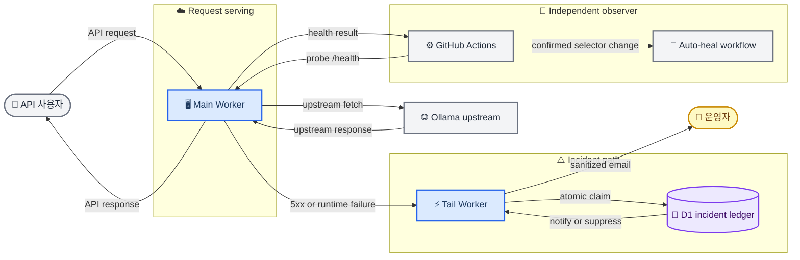

# ADR-001: D1 인시던트 원장과 2-Worker 운영 토폴로지

**상태:** Accepted  
**날짜:** 2026-07-20  
**결정자:** 프로젝트 유지관리자  
**범위:** 프로덕션 배포 경계, 실제 사용자 오류 보고, 인시던트 상태 보존  
**대체:** `docs/superpowers/specs/2026-07-14-ollama-models-platform-design.md`의 §3.6 중 Cloudflare scheduled monitor, Queue, Durable Object, R2를 전제로 한 alert coordination 토폴로지만 대체한다. API, client, scraper, 공개 Status 페이지의 다른 결정은 변경하지 않는다.

## 맥락

현재 운영 경계는 분리되어 있다.

- 문서 사이트는 Cloudflare Pages 프로젝트 `ollama-models`로 배포한다.
- API는 Worker `ollama-models-api`로 배포하고, auto-heal 검증용으로 별도 staging Worker `ollama-models-api-staging`를 둔다.
- API Worker의 Tail consumer는 별도 Worker `ollama-models-alerts`다.
- GitHub Actions는 5분마다 프로덕션 `/health`를 외부에서 probe하고, 연속된 `structure_change`만 auto-heal workflow로 전달한다.

현재 Tail Worker는 `outcome !== "ok"`만 알림 대상으로 삼는다. 이 조건은 handler가 의도적으로 반환한 사용자 가시 `5xx`를 놓칠 수 있다. 또한 현재 email 본문은 raw URL과 error log를 포함할 수 있고, 전송 실패를 조용히 무시한다. 실제 사용자 오류를 조사 가능한 형태로 보고한다는 요구를 충족하지 못한다.

운영 목표는 두 가지다.

1. 정적 문서와 API의 HTTP serving 경계를 하나의 Main Worker로 통합해 프로덕션 서비스 수를 줄인다.
2. 실제 사용자 요청의 `5xx`와 Worker runtime failure를 빠르게, 중복 없이, 민감한 request data 없이 보고한다.

GitHub Actions의 외부 health probe와 제한된 auto-heal은 유지한다. GitHub Actions schedule은 지연되거나 누락될 수 있으므로, 사용자 오류의 실시간 notifier나 단일 진실 원천으로 사용하지 않는다. NetBird DNS와 현재 공개 route는 이 ADR의 범위 밖이다.

## 개념도



## 결정

### 1. 프로덕션 목표는 Main Worker와 Tail Worker 두 개다

완료된 cutover의 프로덕션 토폴로지는 다음 두 Worker service로 구성한다.

1. **Main Worker**는 `docs/dist` 정적 asset과 `/api/*`를 제공한다. 정적 asset은 Workers Static Assets를 사용하고, Worker 코드는 `/api/*`에만 먼저 실행한다.
2. **Tail Worker**는 Main Worker의 Tail consumer다. 인시던트를 정규화하고 D1에 기록한 뒤, 조건을 만족하는 알림만 Cloudflare Email Service로 전송한다.

staging은 production과 분리된 검증 target으로 계속 유지한다. 이는 운영 서비스 통합의 예외가 아니라 production 변경을 검증하는 의도적인 격리 경계다.

이 ADR은 즉시 Pages, 현재 `workers.dev` API origin, 또는 사용자-facing route를 제거하지 않는다. DNS 및 public route cutover는 rollback 경로와 browser smoke test가 승인된 별도 변경에서만 수행한다.

### 2. Tail Worker는 정제된 사용자 오류 signal을 D1에 기록한다

Tail Worker는 `/health`를 사용자 요청 인시던트 stream에서 제외한다. `/health`의 지속 장애와 selector repair는 GitHub Actions의 외부 probe가 판단한다.

그 밖의 event는 다음 중 하나를 만족할 때만 후보가 된다.

- Tail event의 HTTP response status가 `500` 이상이다.
- Worker execution outcome이 정상 완료가 아니다.

후보 event는 아래 값만 가진 compact signal로 정규화한다.

- Worker script name
- query string을 제거한 정규화 route
- HTTP status family 또는 runtime failure class
- 공개 error code
- 관측 시각

fingerprint는 정규화한 위 signal의 안정적인 hash다. raw query, model identifier, full URL, upstream HTML, request header, stack trace, secret, email recipient는 fingerprint, D1, email subject/body, public response에 저장하지 않는다.

### 3. D1은 인시던트의 정본 상태를 보관한다

Tail Worker는 D1의 unique fingerprint를 이용해 인시던트 claim, 발생 횟수 증가, 알림 억제를 원자적으로 결정한다. 최소 상태는 다음과 같다.

```text
incidents
- fingerprint              PRIMARY KEY
- classification
- normalized_route
- first_seen_at
- last_seen_at
- occurrence_count
- next_notify_at
- last_notified_at
- notification_state
```

동일 fingerprint가 동시에 여러 번 도착해도 하나의 SQL transaction만 최초 알림 권한을 얻어야 한다. 구현은 D1 prepared statement와 unique constraint, 조건부 update 또는 transaction batch를 사용한다. claim에 사용하는 read/write는 D1 primary에서 수행하며, read replication의 비동기 replica를 판단에 사용하지 않는다.

D1에는 집계 상태만 보관한다. 상세 execution log와 조사 artifact는 Workers Logs가 담당한다. 보존 기간과 cleanup job은 구현 계획에서 명시하고, raw request data archive는 별도 privacy·retention 결정 없이는 추가하지 않는다.

### 4. email은 통찰력 있는 at-least-once notification이다

D1 claim이 `new` 또는 재알림 가능 상태를 반환한 경우에만 Tail Worker가 email을 보낸다. email에는 다음을 포함한다.

- 분류와 route
- HTTP status family 또는 runtime failure class
- 공개 error code
- 최초·최근 발생 시각
- 누적 발생 횟수
- 현재 대응 방향: upstream 확인, parser 조사, 또는 runtime 조사

같은 인시던트의 반복 event는 발생 횟수와 최근 발생 시각만 갱신한다. 재알림 interval은 runtime configuration으로 두며, 다음 matching event가 interval 이후에 도착했을 때만 보낸다. 숨겨진 cron이나 무제한 즉시 email은 사용하지 않는다.

D1 state update와 외부 Email Service 전송은 하나의 atomic transaction이 될 수 없다. 따라서 delivery semantics는 **at-least-once**다. 드문 중복 email은 허용하지만, 전송 오류를 catch 후 무시해서는 안 된다. 전송 실패와 불확실한 결과는 D1 notification state 및 Workers Logs에 남겨 다음 matching event에서 재시도 가능한 상태로 만든다.

### 5. GitHub Actions는 독립적인 외부 health observer로 유지한다

GitHub Actions health monitor는 5분 간격의 외부 `/health` probe와 `structure_change` auto-heal gate를 계속 소유한다. 이 workflow는 사용자 요청 `5xx`의 notifier나 D1의 정본 writer가 아니다.

첫 구현은 GitHub Actions에 D1 읽기 credential을 추가하지 않는다. 운영자가 D1 기반 일일 digest, 장기 집계, 또는 escalation을 요구하면 Cloudflare API token의 최소 권한, retention, notifier를 별도 결정으로 검토한다.

### 6. R2와 Durable Objects는 이번 alert path에서 사용하지 않는다

R2는 conditional write와 강한 일관성을 제공하지만, 반복 count의 원자적 갱신, 관계형 집계, 인시던트 조회, scheduled transition에 부적합하다. R2는 향후 정제된 대용량 forensic artifact가 실제로 필요할 때만 별도 결정으로 사용한다.

Durable Objects는 per-fingerprint alarm과 serial coordination에 적합하다. 그러나 이 서비스는 D1의 SQL 조회·집계가 더 유용하고, periodic health observation은 이미 GitHub Actions가 담당한다. 따라서 이번 결정에서는 Durable Object를 추가하지 않는다.

## 대안

### 단일 Main Worker만 사용

거부한다. API handler가 잡아 반환한 오류는 직접 email로 보낼 수 있지만, handler가 시작하지 못했거나 runtime이 중단된 경우를 자기 자신이 신뢰성 있게 관찰할 수 없다. Tail handler는 별도 Worker service여야 한다.

### Durable Objects를 인시던트 coordinator로 사용

거부한다. Durable Object SQLite storage는 강한 per-object coordination과 alarm을 제공한다. 그러나 현재 요구는 timer-driven reminder보다 오류 이력, SQL 집계, 조사 가능한 인시던트 원장에 가깝다. D1은 이 요구를 더 단순하게 충족한다.

### R2 object를 인시던트 상태로 사용

거부한다. `If-None-Match`로 최초 object 생성을 claim할 수 있지만, 반복 count와 notification state는 read-modify-write 충돌 재시도가 필요하다. SQL query, transaction, alarm도 없다. object storage를 hot coordination state로 사용하면 구현과 운영 비용이 늘어난다.

### GitHub Actions만으로 monitoring과 알림을 수행

거부한다. GitHub Actions는 Cloudflare 밖에서 실제 endpoint를 확인하는 중요한 signal이지만, schedule 실행은 실시간 보장이 없고 개별 사용자 요청의 handled `5xx`를 즉시 수집하지 못한다.

### Queue, Cloudflare scheduled monitor, R2 archive를 함께 도입

거부한다. 이전 설계의 이 조합은 더 많은 Worker/service와 delivery path를 만든다. 현재 목표인 운영 단순화와 맞지 않는다. Email retry와 archival requirements가 실제로 확인될 때만 별도 결정으로 추가한다.

## 결과와 제약

### 이점

- 완료된 production cutover 후 Main Worker와 Tail Worker 두 서비스만 운영한다.
- handled `5xx`와 runtime failure를 모두 같은 인시던트 모델로 처리한다.
- unique fingerprint와 D1 transaction으로 notification 폭주를 막는다.
- 오류 이력과 누적 횟수를 SQL로 조사할 수 있다.
- Cloudflare 내부 signal과 GitHub Actions의 외부 health signal이 서로 독립적으로 남는다.
- request data를 보관하지 않아 user input과 credential 노출 위험을 줄인다.

### 비용과 위험

- Tail Worker는 제거할 수 없다. terminal runtime failure 관찰에는 별도 실행 경계가 필요하다.
- D1 binding, schema migration, retention cleanup, email failure state를 운영해야 한다.
- D1 write 또는 Email Service가 실패하면 알림이 늦어질 수 있다. 이 설계는 정확히 한 번 전송을 주장하지 않는다.
- GitHub Actions가 D1을 읽지 않으므로 최초 구현에는 자동 daily digest가 없다.
- Main Worker asset cutover는 현재 Pages proxy 및 공개 origin의 호환성을 별도로 검증해야 한다.
- static asset 요청은 Worker-first route와 분리되지만, `/api/*` 요청은 Worker invocation 및 해당 사용량을 발생시킨다.

## 구현 전 검증 조건

세부 구현 계획은 이 ADR 검토 후 작성한다. 최소 검증 조건은 다음과 같다.

1. Cloudflare Workers Vitest integration과 Miniflare binding으로 실제 production Hono app을 실행한다. route, middleware, validation을 mock server에 재구현하지 않는다.
2. 동일 fingerprint의 동시 event가 하나의 initial notification claim만 만들음을 검증한다.
3. handler가 반환한 structured `5xx`와 unhandled runtime failure가 모두 정규화 signal이 됨을 검증한다.
4. query string, raw URL, raw exception, header가 D1 record와 email payload에 나타나지 않음을 검증한다.
5. email send failure가 조용히 사라지지 않고 retry 가능한 notification state를 남김을 검증한다.
6. `/health` event가 사용자 요청 알림을 만들지 않고 GitHub Actions health path와 충돌하지 않음을 검증한다.
7. staging과 browser smoke test가 성공하기 전에는 Pages/API public route를 교체하지 않는다.

## 참고

- [Cloudflare Workers Static Assets](https://developers.cloudflare.com/workers/static-assets/)
- [Cloudflare Tail Workers](https://developers.cloudflare.com/workers/observability/logs/tail-workers/)
- [Cloudflare Tail handler API](https://developers.cloudflare.com/workers/runtime-apis/handlers/tail/)
- [Cloudflare D1 Worker API](https://developers.cloudflare.com/d1/worker-api/d1-database/)
- [Cloudflare D1 read replication guidance](https://developers.cloudflare.com/d1/best-practices/read-replication/)
- [Cloudflare R2 consistency](https://developers.cloudflare.com/r2/reference/consistency/)
- [GitHub Actions scheduled workflows](https://docs.github.com/en/actions/reference/workflows-and-actions/events-that-trigger-workflows#schedule)
