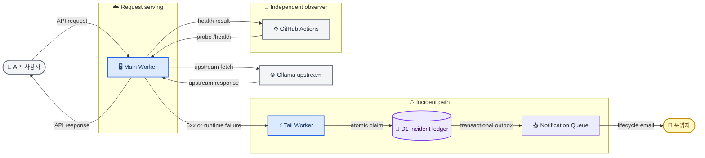

# ADR-001: D1 인시던트 원장과 2-Worker 운영 토폴로지

**상태:** Accepted  
**날짜:** 2026-07-20  
**결정자:** 프로젝트 유지관리자  
**범위:** 프로덕션 배포 경계, 실제 사용자 오류 보고, 인시던트 상태 보존  
**대체:** `docs/superpowers/specs/2026-07-14-ollama-models-platform-design.md`의 §3.6 중 Cloudflare scheduled monitor, Queue, Durable Object, R2를 전제로 한 alert coordination 토폴로지만 대체한다. API, client, scraper, 공개 Status 페이지의 다른 결정은 변경하지 않는다. 이후 [ADR-002](adr-002-event-driven-remediation-operations-plane.md)가 이 문서의 alert path에 대한 Tail direct email, direct auto-heal dispatch, aggregate-only D1 detail을 대체한다.

## 맥락

현재 운영 경계는 분리되어 있다.

- 문서 사이트는 Cloudflare Pages 프로젝트 `ollama-models`로 배포한다.
- API는 Worker `ollama-models-api`로 배포하고, health probe와 smoke test용으로 별도 staging Worker `ollama-models-api-staging`를 둔다.
- API Worker의 Tail consumer는 별도 Worker `ollama-models-alerts`다.
- GitHub Actions는 5분마다 프로덕션 `/health`를 외부에서 probe한다. 자동 복구 workflow dispatch는 취소했으며, 사용자 오류의 정본 writer도 아니다.

현재 Tail Worker는 `outcome !== "ok"`만 알림 대상으로 삼는다. 이 조건은 handler가 의도적으로 반환한 사용자 가시 `5xx`를 놓칠 수 있다. 또한 현재 email 본문은 raw URL과 error log를 포함할 수 있고, 전송 실패를 조용히 무시한다. 실제 사용자 오류를 조사 가능한 형태로 보고한다는 요구를 충족하지 못한다.

운영 목표는 두 가지다.

1. 정적 문서와 API의 HTTP serving 경계를 하나의 Main Worker로 통합해 프로덕션 서비스 수를 줄인다.
2. 실제 사용자 요청의 `5xx`와 Worker runtime failure를 빠르게, 중복 없이, 민감한 request data 없이 보고한다.

GitHub Actions의 외부 health probe는 유지하지만 auto-heal은 취소했다. GitHub Actions schedule은 지연되거나 누락될 수 있으므로, 사용자 오류의 실시간 notifier나 단일 진실 원천으로 사용하지 않는다. NetBird DNS와 현재 공개 route는 이 ADR의 범위 밖이다.

## 개념도

## 결정

### 1. 프로덕션 목표는 Main Worker와 Tail Worker 두 개다

완료된 cutover의 프로덕션 토폴로지는 다음 두 Worker service로 구성한다.

1. **Main Worker**는 `docs/dist` 정적 asset과 `/api/*`를 제공한다. 정적 asset은 Workers Static Assets를 사용하고, Worker 코드는 `/api/*`에만 먼저 실행한다.
2. **Tail/Operations Worker**는 Main Worker의 Tail consumer 경계다. Tail signal은 D1에 기록하고, Operations Worker의 Notification Queue consumer가 조건을 만족하는 운영자 lifecycle email을 전송한다.

staging은 production과 분리된 검증 target으로 계속 유지한다. 이는 운영 서비스 통합의 예외가 아니라 production 변경을 검증하는 의도적인 격리 경계다.

이 ADR은 즉시 Pages, 현재 `workers.dev` API origin, 또는 사용자-facing route를 제거하지 않는다. DNS 및 public route cutover는 rollback 경로와 browser smoke test가 승인된 별도 변경에서만 수행한다.

### 2. Tail Worker는 정제된 사용자 오류 signal을 D1에 기록한다

Tail Worker는 `/health`를 사용자 요청 인시던트 stream에서 제외한다.
> `/health`의 지속 장애와 selector 변화는 GitHub Actions가 관찰만 한다. selector repair나 workflow dispatch는 이 결정에서 실행하지 않는다. 해당 자동 복구 경로는 ADR-002에 따라 취소했다.

그 밖의 event는 다음 중 하나를 만족할 때만 후보가 된다.

- Tail event의 HTTP response status가 `500` 이상이다.
- Worker execution outcome이 정상 완료가 아니다.

후보 event는 아래 값만 가진 compact signal로 정규화한다.

- Worker script name
- query string을 제거한 정규화 route
- HTTP status family 또는 runtime failure class
- 공개 error code
- 관측 시각

fingerprint는 정규화한 위 signal의 안정적인 hash다. raw query, model identifier, full URL, upstream HTML, request header, stack trace, secret, email recipient는 fingerprint, D1, email subject/body, public response에 저장하지 않는다.

### 3. D1은 인시던트 상태와 감사 원장의 정본을 보관한다

ADR-002로 확장된 alert path는 D1에 현재 incident state, append-only audit event, transactional outbox, consumer/notification delivery record를 함께 저장한다. 동일 fingerprint의 동시 event는 하나의 active incident로 합치고 occurrence count와 last-seen 시각을 갱신한다.

D1 state 변경, audit event, outbox row는 하나의 transaction으로 commit한다. Queue publish는 transaction 밖에서 수행하며 실패한 publish는 outbox recovery가 재시도한다. 상세 schema와 claim/idempotency invariant는 [ADR-002](adr-002-event-driven-remediation-operations-plane.md)를 따른다.

### 4. email은 Notification Queue를 통한 at-least-once 알림이다

Notification consumer는 D1에서 정제된 lifecycle context를 읽고 구성된 운영자 recipient에게 email을 보낸다. API caller에게 별도 알림을 보내지 않는다.

email에는 분류, 정규화 route, status/failure class, public error code, 최초·최근 발생 시각, 누적 발생 횟수, 현재 대응 방향만 포함한다. raw URL, query, header, stack trace, upstream HTML, secret은 포함하지 않는다.

D1 state update와 외부 Email Service 전송은 하나의 atomic transaction이 될 수 없다. Queue retry, consumer claim, notification delivery record를 사용해 at-least-once를 관리하며, 드문 중복 email 가능성은 남는다.

### 5. GitHub Actions는 독립적인 외부 health observer로 유지한다
> **ADR-002에 의해 대체됨:** GitHub Actions는 `/health` probe만 수행한다. `structure_change`를 자동 복구 workflow로 전달하지 않는다.

GitHub Actions health monitor는 5분 간격의 외부 `/health` probe를 소유한다. 이 workflow는 사용자 요청 `5xx`의 notifier나 D1의 정본 writer가 아니며, auto-heal gate를 실행하지 않는다.

첫 구현은 GitHub Actions에 D1 읽기 credential을 추가하지 않는다. 운영자가 D1 기반 일일 digest, 장기 집계, 또는 escalation을 요구하면 Cloudflare API token의 최소 권한, retention, notifier를 별도 결정으로 검토한다.

### 6. R2와 Durable Objects는 이번 alert path에서 사용하지 않는다

R2는 conditional write와 강한 일관성을 제공하지만, 반복 count의 원자적 갱신, 관계형 집계, 인시던트 조회, scheduled transition에 부적합하다. R2는 향후 정제된 대용량 forensic artifact가 실제로 필요할 때만 별도 결정으로 사용한다.

Durable Objects는 per-fingerprint alarm과 serial coordination에 적합하다. 그러나 이 서비스는 D1의 SQL 조회·집계가 더 유용하고, periodic health observation은 이미 GitHub Actions가 담당한다. 따라서 이번 결정에서는 Durable Object를 추가하지 않는다.

## 대안

### 단일 Main Worker만 사용

거부한다. API handler가 잡아 반환한 오류는 직접 email로 보낼 수 있지만, handler가 시작하지 못했거나 runtime이 중단된 경우를 자기 자신이 신뢰성 있게 관찰할 수 없다. Tail handler는 별도 Worker service여야 한다.

### Durable Objects를 인시던트 coordinator로 사용

거부한다. Durable Object SQLite storage는 강한 per-object coordination과 alarm을 제공한다. 그러나 현재 요구는 timer-driven reminder보다 오류 이력, SQL 집계, 조사 가능한 인시던트 원장에 가깝다. D1은 이 요구를 더 단순하게 충족한다.

### R2 object를 인시던트 상태로 사용

거부한다. `If-None-Match`로 최초 object 생성을 claim할 수 있지만, 반복 count와 notification state는 read-modify-write 충돌 재시도가 필요하다. SQL query, transaction, alarm도 없다. object storage를 hot coordination state로 사용하면 구현과 운영 비용이 늘어난다.

### GitHub Actions만으로 monitoring과 알림을 수행

거부한다. GitHub Actions는 Cloudflare 밖에서 실제 endpoint를 확인하는 중요한 signal이지만, schedule 실행은 실시간 보장이 없고 개별 사용자 요청의 handled `5xx`를 즉시 수집하지 못한다.

### Queue와 Cloudflare scheduled monitor를 alert path에 도입

이전 설계에서 거부했던 Queue 조합은 이 ADR의 범위에서는 여전히 과도했지만, [ADR-002](adr-002-event-driven-remediation-operations-plane.md)가 Notification Queue와 명시적인 outbox recovery만 좁은 범위로 채택한다. Repair/verification Queue와 time-triggered reminder는 도입하지 않는다. R2 archive는 계속 별도 결정으로 보류한다.

## 결과와 제약

### 이점

- 완료된 production cutover 후 Main Worker와 Tail/Operations Worker 두 서비스만 운영한다.
- handled `5xx`와 runtime failure를 모두 같은 인시던트 모델로 처리한다.
- unique fingerprint와 D1 transaction으로 notification 폭주를 막고 outbox recovery로 publish failure를 재시도한다.
- 오류 이력, 누적 횟수, delivery 상태를 SQL로 조사할 수 있다.
- Cloudflare 내부 signal과 GitHub Actions의 외부 health signal이 서로 독립적으로 남는다.
- request data를 보관하지 않아 user input과 credential 노출 위험을 줄인다.

### 비용과 위험

- Tail/Operations Worker는 제거할 수 없다. terminal runtime failure 관찰에는 별도 실행 경계가 필요하다.
- D1 binding, schema migration, retention cleanup, outbox, Queue, DLQ, email failure state를 운영해야 한다.
- D1 write, Queue, 또는 Email Service가 실패하면 알림이 늦어질 수 있다. 이 설계는 정확히 한 번 전송을 주장하지 않는다.
- GitHub Actions가 D1을 읽지 않으므로 최초 구현에는 자동 daily digest가 없다.
- Main Worker asset cutover는 현재 Pages proxy 및 공개 origin의 호환성을 별도로 검증해야 한다.
- static asset 요청은 Worker-first route와 분리되지만, `/api/*` 요청은 Worker invocation 및 해당 사용량을 발생시킨다.

## 구현 전 검증 조건

세부 구현 계획은 이 ADR 검토 후 작성한다. 최소 검증 조건은 다음과 같다.

1. Cloudflare Workers Vitest integration과 Miniflare binding으로 실제 production Hono app을 실행한다. route, middleware, validation을 mock server에 재구현하지 않는다.
2. 동일 fingerprint의 동시 event가 하나의 initial notification claim만 만들음을 검증한다.
3. handler가 반환한 structured `5xx`와 unhandled runtime failure가 모두 정규화 signal이 됨을 검증한다.
4. query string, raw URL, raw exception, header가 D1 record와 email payload에 나타나지 않음을 검증한다.
5. email send failure가 조용히 사라지지 않고 retry 가능한 notification state를 남김을 검증한다.
6. `/health` event가 사용자 요청 알림을 만들지 않고 GitHub Actions health path와 충돌하지 않음을 검증한다.
7. staging과 browser smoke test가 성공하기 전에는 Pages/API public route를 교체하지 않는다.

## 참고

- [Cloudflare Workers Static Assets](https://developers.cloudflare.com/workers/static-assets/)
- [Cloudflare Tail Workers](https://developers.cloudflare.com/workers/observability/logs/tail-workers/)
- [Cloudflare Tail handler API](https://developers.cloudflare.com/workers/runtime-apis/handlers/tail/)
- [Cloudflare D1 Worker API](https://developers.cloudflare.com/d1/worker-api/d1-database/)
- [Cloudflare D1 read replication guidance](https://developers.cloudflare.com/d1/best-practices/read-replication/)
- [Cloudflare R2 consistency](https://developers.cloudflare.com/r2/reference/consistency/)
- [GitHub Actions scheduled workflows](https://docs.github.com/en/actions/reference/workflows-and-actions/events-that-trigger-workflows#schedule)
