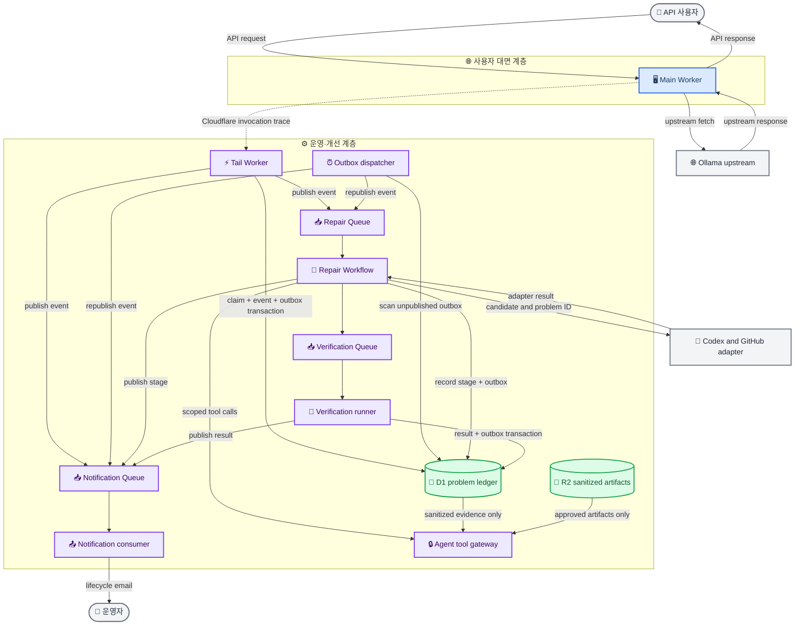

# ADR-002: Event-driven 운영·개선 계층과 제한된 자동 복구

**상태:** Proposed
**날짜:** 2026-07-20  
**결정자:** 프로젝트 유지관리자  
**범위:** 사용자 오류의 발견·감사·알림·분석·수정·검증·배포 관찰  
**기반:** [ADR-001](adr-001-d1-incident-ledger-and-worker-consolidation.md)의 D1 인시던트 원장과 Main/Tail Worker 경계  
**대체:** ADR-001 §4의 Tail Worker 직접 email 전송과 “숨겨진 cron” 금지를 delivery recovery에 한해 대체하고, §6의 R2 미사용 결정을 sanitized artifact에 한해 대체한다. 이 ADR은 time-triggered reminder notification을 허용하지 않는다. ADR-001의 Main Worker와 Tail Worker 사이 화살표는 직접 호출이 아니라 Cloudflare invocation trace의 자동 전달로 해석한다.

## 맥락

ADR-001은 D1을 인시던트의 정본으로 선택하고, 사용자 대면 Main Worker와 별도 Tail Worker를 유지했다. 그러나 단순한 최초 오류 email만으로는 사용자가 문제를 발견한 뒤 어떤 분석·수정·테스트·배포가 진행됐는지 알 수 없다.

현재 `health-monitor.yml`은 5분 간격으로 `/health`를 외부에서 확인하고, 연속된 `structure_change`만 `auto-heal.yml`로 전달한다. `auto-heal.yml`은 GitHub에서 OpenCode를 실행해 scraper selector patch와 PR을 만들 수 있지만, 실제 사용자 요청의 handled `5xx`는 이 경로에 들어오지 않는다. 또한 GitHub PR과 Issue는 인시던트 audit 원장이 아니며, agent가 D1을 직접 조회하게 하면 credential과 개인정보 경계가 무너진다.

필요한 구조는 실행 가능한 component를 두 계층으로 나누는 것이다.

1. **사용자 대면 계층**은 docs asset과 API request를 처리하고, 운영 작업을 기다리지 않는다.
2. **운영·개선 계층**은 Cloudflare가 전달한 execution trace를 감사하고, 문제 ID를 만들며, notification·analysis·candidate repair·test·deployment observation을 비동기로 수행한다.

이 결정에서 Cloudflare는 data plane과 control plane을 소유한다. Codex와 GitHub는 Cloudflare Workflow가 최소 권한으로 호출하는 outbound repair adapter다. 이 adapter는 D1 credential이나 raw request data를 받지 않는다. API caller의 identity 또는 email address는 현재 API contract에 없으므로, 이 ADR의 "사용자 알림"은 구성된 운영자 recipient에게 보내는 lifecycle email을 뜻한다. 개별 API caller notification은 인증·동의·연락처 contract를 별도 결정하기 전에는 구현하지 않는다.

## 개념도

## 결정

### 1. 하나의 사용자 대면 계층과 하나의 운영·개선 계층을 유지한다

Main Worker는 docs asset과 `/api/*`를 처리한다. Main Worker는 email, D1 write, AI analysis, code repair, test 실행을 동기적으로 호출하지 않는다. 따라서 사용자 latency와 availability는 remediation workload의 queue backlog, model failure, test timeout에 영향을 받지 않는다.

기존 alerts Worker는 **Operations Worker**로 확장한다. 이 Worker는 Tail handler, Queue consumer, D1 outbox dispatcher, Workflow starter를 소유한다. Queue와 Workflow는 독립된 실행 component지만 별도의 public HTTP Worker service가 아니다. 완료된 production cutover의 public serving service 수는 ADR-001과 같이 Main Worker와 Operations Worker 두 개다. staging target은 의도적으로 별도 유지한다.

Main Worker가 Tail Worker를 직접 호출하지 않는다. Cloudflare Tail consumer가 invocation trace를 자동 전달하고, Tail handler가 HTTP `5xx` 또는 non-`ok` runtime outcome을 후보로 분류한다. `/health`의 지속 장애와 selector repair trigger는 GitHub Actions의 외부 probe가 계속 판단한다.

### 2. D1은 problem state, append-only audit, 그리고 transactional outbox를 보관한다

D1은 다음 논리 record를 보관한다.

| Record | 책임 | 주요 invariant |
|---|---|---|
| `problems` | fingerprint별 현재 상태와 `problem_id` | 하나의 active fingerprint에는 하나의 open problem만 존재한다. |
| `problem_events` | 발견·분석·수정·test·배포·복구·중단 사유 | append-only이며 `event_id`가 안정적이다. |
| `repair_runs` | agent가 수행한 candidate repair attempt | 같은 problem의 active repair run은 하나다. |
| `verification_runs` | Miniflare, staging, deploy observation 결과 | result와 reason은 run마다 immutable하다. |
| `outbox_events` | Queue로 전달해야 할 business event | state transition과 같은 D1 transaction에 기록한다. |
| `outbox_dispatch_lease` | outbox 재발행의 singleton ownership | 만료하지 않은 lease는 하나의 holder만 가진다. |
| `notification_deliveries` | recipient별 event delivery attempt | `event_id` 기반 idempotency를 강제한다. |
D1은 Queue producer가 아니다. event writer는 state transition, audit event, destination별 outbox row를 **같은 D1 transaction**으로 commit한 뒤 Queue publish를 즉시 시도한다. Queue send는 그 transaction에 포함되지 않는다.

#### Outbox recovery schedule

Operations Worker는 Wrangler cron `* * * * *`로 실행하는 명시적 `outbox-recovery` scheduled handler를 가진다. 이 handler는 reminder notification을 만들거나 시간만으로 problem 상태를 바꾸지 않는다. `published_at IS NULL`인 이미 commit된 outbox row만 재발행한다. producer가 즉시 publish에 성공하면 동일 row의 `published_at`을 기록해 중복을 줄인다.

handler는 D1의 `outbox_dispatch_lease`를 조건부로 claim한 holder만 실행한다. lease는 45초 후 만료되고, 한 번에 최대 100건만 처리한다. Queue send 뒤 `published_at` 기록 전에 process가 종료되면 row는 재발행될 수 있다. notification과 repair consumer는 `event_id`를 `notification_deliveries` 또는 자기 delivery record에서 claim하여 at-least-once Queue delivery를 멱등 처리한다.

### 3. notification, repair, verification을 느슨하게 연결한다

각 component는 Queue event만 계약으로 공유한다. payload는 `event_id`, `problem_id`, event type, schema version, 발생 시각만 포함한다. consumer는 상세 context가 필요할 때 Agent Tool Gateway 또는 내부 repository에서 정제된 record를 읽는다.

| Queue | Producer | Consumer | 책임 |
|---|---|---|---|
| `NOTIFICATION_EVENTS` | Tail, Repair Workflow, Verification Runner, outbox dispatcher | Notification consumer | lifecycle email 전송과 delivery retry |
| `REPAIR_EVENTS` | Tail, outbox dispatcher | Repair Workflow starter | repairable problem의 triage와 repair run 시작 |
| `VERIFICATION_JOBS` | Repair Workflow | Verification runner | candidate patch 재현, Miniflare, staging, deployment observation |

각 Queue는 dead-letter queue를 갖는다. DLQ event는 새 상태를 만들지 않고 원래 `event_id`의 delivery failure를 audit event로 기록한다. email 또는 test consumer가 실패해도 Main Worker request는 영향을 받지 않는다.

email은 다음 business-level event마다 전송한다: 문제 발견, triage 결과, 분석 시작, 각 repair attempt, candidate 생성, 각 verification 결과, deployment 결과, 복구, retry budget 소진 또는 human escalation. 모든 internal log line을 별도 mail로 보내지는 않는다. 각 workflow step의 input, output, reason, failure detail은 D1 event 및 정제 artifact에 보관하고, email은 해당 step의 완결된 상태를 빠짐없이 전달한다.

### 4. agent는 scoped tool만 사용하고, repair authority는 분리한다

Repair Workflow는 `problem_id`와 `repair_run_id`를 가진 capability를 만들어 Codex/GitHub adapter에 전달한다. adapter가 호출할 수 있는 tool은 allowlist로 제한한다.

- `get_problem_summary(problem_id)`
- `get_attempt_history(problem_id)`
- `get_sanitized_evidence(problem_id, artifact_id)`
- `record_hypothesis(repair_run_id, summary, reason)`
- `request_verification(repair_run_id, candidate_id)`
- `record_adapter_result(repair_run_id, result, reason)`

Agent Tool Gateway는 capability의 problem/run scope, expiry, tool name, input schema를 검증한다. gateway는 prepared query만 실행하며 arbitrary SQL, D1 credentials, secret, production deployment credential을 반환하지 않는다. agent가 작성한 prose, patch, test output은 untrusted input으로 취급한다.

R2는 sanitized fixture, captured evidence manifest, candidate patch artifact, test report만 보관한다. R2는 problem state나 dedupe store가 아니다. raw user request data와 credentials는 archive하지 않는다. artifact는 `problem_id`와 `repair_run_id` scope로 access하며 retention cleanup을 갖는다.

GitHub은 source repository, PR, Actions runner를 제공하는 outbound adapter다. Cloudflare가 GitHub Action을 dispatch할 때 opaque `problem_id`와 one-time capability만 전달한다. GitHub runner는 Cloudflare Agent Tool Gateway를 통해 필요한 정제 evidence만 읽고, 완료·실패·중단 event를 capability로 Operations Worker에 callback한다. GitHub Issue는 human escalation mirror로만 사용하며 D1 problem record를 대체하지 않는다.

### 5. 자동 복구는 evidence와 policy를 통과한 범위에서만 진행한다

repair classifier는 다음 세 결과 중 하나를 반환한다.

| Class | 자동화 | 예시 |
|---|---|---|
| `repairable` | candidate patch, verification, PR 생성까지 자동 | 재현 가능한 selector/parsed-schema regression |
| `investigate_only` | analysis·retry·notification만 자동 | upstream outage, transient network failure, rate limit |
| `needs_human` | audit·notification·escalation만 자동 | secret, dependency, workflow, deployment config, D1 migration, allowlist 밖 수정 |

`repairable` class라도 agent patch는 사전 승인된 scraper source, targeted test, fixture directory만 바꿀 수 있다. candidate는 기존 실제 Hono app을 실행하는 Miniflare test, immutable captured fixture regression, staging smoke test를 통과해야 한다. 허용되지 않은 파일 변경, evidence 부족, test failure, retry budget 소진은 `needs_human` event를 만든다.

자동 PR 생성은 허용한다. 자동 merge와 production deploy는 required checks, protected branch policy, staging verification, last-known-good rollback path가 실제로 구성·검증된 뒤에만 별도 policy decision으로 활성화한다. 이 전에는 agent가 production mutation을 할 수 없다.

### 6. GitHub Actions와 Cloudflare deployment는 lifecycle event를 반환한다

GitHub Actions는 source checkout, Miniflare test, staging deploy, PR lifecycle, production deploy를 계속 수행할 수 있다. Repair Workflow가 dispatch한 run에는 `problem_id`를 전달하고, workflow는 시작·candidate·test·staging·deploy·rollback 결과를 Operations Worker에 callback한다. Operations Worker는 callback을 D1 audit/outbox transaction으로 기록해 Notification Queue로 전달한다.

배포 workflow가 repair와 무관하게 실행될 때도 deployment result를 lifecycle event로 보낼 수 있다. 이 heuristic은 최근 open problem과 fingerprint, affected route, candidate commit을 비교해 해당 problem을 `resolved`, `still_failing`, 또는 `needs_human`으로 전환한다. deploy success만으로 문제를 resolve하지 않으며, post-deploy smoke result가 필요하다.

## 대안

### Tail Worker가 직접 email을 전송

거부한다. email retry, repair, test가 같은 failure domain에 묶이고, 발견 이후의 lifecycle을 전달할 수 없다. Queue와 outbox는 delivery workload를 request/trace handling에서 분리한다.

### D1 state 변경이 Queue event를 자동 emit한다고 가정

거부한다. D1에는 database trigger 기반 Queue publish가 없다. D1 transaction과 Queue send도 하나의 atomic operation이 아니다. transactional outbox와 idempotent consumer가 필요하다.

### Codex agent에 D1 read token 또는 arbitrary SQL 제공

거부한다. agent prompt injection, implementation bug, compromised adapter가 인시던트 이력과 비밀 경계를 넘어 읽을 수 있다. typed tool gateway와 problem/run-scoped capability가 더 좁은 권한을 준다.

### GitHub Issue를 problem record로 사용

거부한다. Issue는 사람이 읽기 좋은 escalation surface지만 transaction, event ordering, delivery idempotency, internal evidence access를 제공하지 않는다. D1이 정본이고 Issue는 opaque `problem_id`를 가진 mirror다.

### 모든 오류를 즉시 code repair로 처리

거부한다. upstream outage와 network failure는 코드 수정으로 복구되지 않는다. classifier와 allowlist는 AI가 무관한 파일·workflow·secret을 수정하는 것을 막는다.

### 엄격한 Cloudflare-only 실행으로 Codex와 GitHub를 제거

거부한다. Workers AI만으로도 analysis는 가능하지만, 현재 source repository의 PR·required-check·merge lifecycle을 대체하지 못한다. Cloudflare가 data/control plane을 유지하고 Codex/GitHub를 최소 권한 outbound adapter로 제한하는 편이 사용자 요구와 현재 repository workflow를 함께 충족한다.

## 결과와 제약

### 이점

- Main Worker는 remediation workload와 분리되어 사용자 latency를 보호한다.
- 실제 사용자 `5xx`와 runtime failure가 `problem_id`를 받아 기존 health-triggered auto-heal과 같은 lifecycle으로 들어간다.
- 발견부터 복구·중단까지 모든 business-level attempt와 reason이 D1 audit event와 email로 남는다.
- Queue backlog, email retry, test failure, agent outage가 독립적으로 재시도·DLQ 처리된다.
- Codex/GitHub adapter는 scoped data만 읽고 D1 credential을 받지 않는다.
- R2는 bounded artifact store로만 사용해 D1 hot state를 단순하게 유지한다.

### 비용과 위험

- D1, Queues, Workflows, R2, Email Service, AI Gateway와 GitHub adapter의 lifecycle을 운영해야 한다.
- Queue와 Email Service는 at-least-once delivery이므로 드문 duplicate notification은 가능하다.
- transactional outbox dispatcher가 없거나 멱등 consumer가 잘못되면 event가 유실되거나 반복될 수 있다.
- Codex/GitHub는 외부 dependency다. adapter outage 또는 credential failure는 repair run을 `blocked`로 기록하고 notify해야 한다.
- 모든 business-level step을 email로 보내므로 recipient volume이 늘어난다. recipient policy와 retry budget은 runtime configuration으로 유지해야 한다.
- 자동 merge/deploy는 현재 결정에서 활성화하지 않는다. 잘못된 자동 patch가 production에 도달하는 위험보다 candidate·test·PR 자동화의 이익이 크다.

## 구현 전 검증 조건

세부 구현 계획은 이 ADR 검토 후 작성한다. 최소 검증 조건은 다음과 같다.

1. Cloudflare Workers Vitest integration과 Miniflare로 실제 Hono app, D1 binding, Queue consumer를 실행한다. route, middleware, validation을 mock server에 재구현하지 않는다.
2. Tail event에서 같은 fingerprint가 동시에 들어와도 하나의 open problem과 one initial outbox event만 commit됨을 검증한다.
3. D1 commit 직후 Queue publish가 실패하거나 process가 중단된 경우 outbox dispatcher가 event를 재발행함을 검증한다.
4. duplicate Queue message가 email, repair run, verification run을 중복 생성하지 않음을 검증한다.
5. Agent Tool Gateway가 expired/wrong-scope capability, arbitrary SQL, raw URL/query/header 요청을 거부함을 검증한다.
6. `repairable`, `investigate_only`, `needs_human` classifier가 upstream outage와 selector regression을 올바르게 분리함을 검증한다.
7. GitHub adapter callback의 signature·capability를 검증하고, callback event가 D1 audit과 notification outbox에 기록됨을 검증한다.
8. staging smoke와 post-deploy check가 성공하기 전에는 문제를 `resolved`로 표시하지 않음을 검증한다.
9. notification, repair, verification component의 consumer failure가 Main Worker response latency 또는 status code를 바꾸지 않음을 검증한다.

## 참고

- [Cloudflare Tail Workers](https://developers.cloudflare.com/workers/observability/logs/tail-workers/)
- [Cloudflare Tail handler API](https://developers.cloudflare.com/workers/runtime-apis/handlers/tail/)
- [Cloudflare Cron Triggers](https://developers.cloudflare.com/workers/configuration/cron-triggers/)
- [Cloudflare D1 Worker API](https://developers.cloudflare.com/d1/worker-api/d1-database/)
- [Cloudflare Queues](https://developers.cloudflare.com/queues/)
- [Cloudflare Queue delivery guarantees](https://developers.cloudflare.com/queues/reference/delivery-guarantees/)
- [Cloudflare Workflows](https://developers.cloudflare.com/workflows/)
- [Cloudflare AI Gateway](https://developers.cloudflare.com/ai-gateway/)
- [Cloudflare Workers AI](https://developers.cloudflare.com/workers-ai/)
