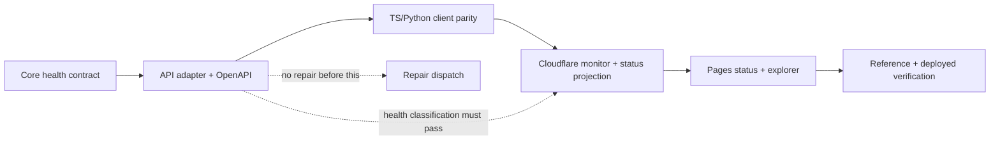

# Ollama Models Platform Implementation Plan

> **Status:** Superseded on 2026-08-01. This historical plan is not an implementation source. The current scope is D1 incident audit and operator notification; automatic repair, agent execution, and repair/verification workflows are canceled. Use ADR-002 and `.planning/operations-plane-migration-plan.md` for current work.

**Goal:** Normalize scraper-origin failures into a D1 audit trail and deliver bounded operator notifications without changing the public API contract.

**Architecture:** Main/Tail Workers remain the serving and observation boundary. A future Operations Worker may own D1 audit, Notification Queue delivery, outbox recovery, and DLQ terminal records. No automatic code repair or agent gateway is part of the current scope.

**Tech Stack:** TypeScript, Cloudflare Workers, D1, Queues, Email Service, Hono, Zod, Vitest, pytest, Astro, and GitHub Actions for probe-only health observation.

## Global Constraints

- `api/src/schemas.ts`는 API/OpenAPI contract의 단일 경계로 유지한다. Core validator를 추가해도 API schema를 대체하거나 별도 AI schema를 만들지 않는다.
- API와 health monitor는 fixed catalog model을 쓰지 않고 search 결과의 returned `model_id`만 후속 tag probe에 사용한다.
- API health는 cache하지 않으며, valid unhealthy `503` body는 decode하고 transport/schema failure와 혼동하지 않는다.
- non-secret runtime configuration은 각 Worker의 `wrangler.toml` `[vars]`에만 둔다. secret은 Workers 또는 GitHub environment secret으로만 주입한다.
- public `/status.json`은 fresh snapshot의 `200` 또는 exact unavailable `503`만 반환하고, 모든 variant에 `Cache-Control: no-store`를 붙인다.
- status browser는 initial load, visibility regain, visible-only 60-second interval에서 same-origin `/status.json`만 읽고 `/health`를 호출하지 않는다.
- Automatic repair jobs and agent execution are canceled; operators use the normal branch, test, and PR process for code changes.
- route handler 또는 middleware를 mock server로 재구현하지 않는다. integration test는 production Hono `app`을 직접 import한다.

---

> **Status:** Superseded by the 2026-08-01 scope correction. Keep this file as historical context only; do not execute its former repair or agent steps.

**선행 설계:** `docs/superpowers/specs/2026-07-14-ollama-models-platform-design.md`

## Task Tracking

- [ ] Task 1 — Core package, health contract, public-status contract
- [ ] Task 2 — API thin adapter와 OpenAPI contract
- [ ] Task 3 — TypeScript/Python client parity와 public examples
- [ ] Task 4 — Alerts Worker monitor, incident, status projection, repair boundary
- [ ] Task 5 — Pages Functions, explorer, status experience
- [ ] Task 6 — Generated reference, browser suite, staged deployment verification

각 Task는 해당 section의 test/fixture를 먼저 실패시키고, 최소 구현 후 section 끝의 exact verification을 통과시킨다. Task의 verify command가 green이 된 뒤에만 독립 commit을 만든다.

## 0. 구현 순서와 하드 게이트



다음은 순서 의존성이며 우회하지 않는다.

1. health payload의 origin failure, `skipped`, `failure_kind`, cross-field invariant가 구현·검증되기 전에는 Cron monitor, Tail 기반 health alert, repair dispatch를 배포하지 않는다.
2. monitor는 매분 한 번의 authoritative observation만 만든다. 3회 confirmation은 내부 5초 loop가 아니라 연속된 scheduled cycle의 동일 identity로 계산한다. 이 방식은 `Investigating`과 `Recovering` 상태를 실제로 관찰 가능하게 하고 upstream 부하를 늘리지 않는다.
3. API가 도달 가능하나 scraper health가 실패한 응답은 HTTP `503`이어도 body를 decode한다. HTTP status만으로 health 종류를 결정하지 않는다.
4. agent는 patch artifact만 만들며 GitHub repository write, merge, Cloudflare credential을 받지 않는다. 현재 rollout에는 auto-merge가 없다.

### 고정 health wire contract

`packages/core/src/health-contract.ts`가 아래 wire shape와 semantic validator의 권위 있는 구현체가 된다.

- `FailureKind = "structure_change" | "upstream_down" | "network_error"`.
- attempted success는 `ok: true`, non-null integer `count`, `kind: null`이다.
- attempted failure는 `ok: false`, non-empty safe `error`, non-null `kind`다.
- dependency skip은 `ok: false`, `skipped: true`, safe `error`, `kind: null`, `count` 없음이다. attempted check는 `skipped`를 생략하거나 `false`로 둔다.
- `HealthStatus.ok`는 attempted checks가 모두 성공한 경우에만 `true`다.
- `failure_kind`는 attempted failure의 `worstKind()`와 정확히 같고 healthy일 때만 `null`이다. skip은 집계와 identity에서 제외한다.
- `parseHealthStatus()`는 field type, required `checks.*.kind` 및 `failure_kind`, 그리고 위 invariant를 모두 검사한다. `safeParseHealthStatus()`/type guard는 monitor와 client test에서 diagnostic을 안전하게 다룬다.
- `normalizedProbeIdentity`는 `classification + ordered attempted { componentKey: failureKind }`다. `search` 다음 `model` 순서를 고정하고 skip을 넣지 않는다.

유효한 `503` body는 `failure_kind: "structure_change"`이면 `parser-structure-change`, `"upstream_down"` 또는 `"network_error"`이면 `upstream-degraded`다. monitor-to-API transport failure, HTTP `200`/`503` 이외 status, JSON parse failure, 또는 contract validation failure만 `api-unreachable`이다.

## Task 1: Core package와 health safety gate

### 1.1 Workspace와 source boundary 추가

1. `pnpm-workspace.yaml`에 `packages/core`와 `workers/*` workspace member를 추가한다.
2. `packages/core/`를 private internal package `@ollama-models/core`로 만든다.
   - 추가 파일: `package.json`, `tsconfig.json`, `project.json`, `vitest.config.ts`, `src/index.ts`.
   - target: strict type-check, Vitest test, bundle/build. API와 alerts의 build가 core source/export를 해석하고, package output에 unresolved workspace import가 남지 않도록 한다.
3. core export를 기능별 subpath로 명시한다. 최소 `./health-contract`, `./public-status-contract`, `./errors`, `./search`, `./model`, `./health`, `./model-reference`를 제공한다. health와 public-status decoder subpath는 Zod, Hono, Cloudflare runtime, `node:*` import가 전혀 없는 browser/Pages-safe module이어야 한다.
4. 기존 API domain implementation을 다음 경계로 이동한다. adapter alias를 남기지 않고 API import를 새 core export로 전환한 뒤 옛 implementation 파일을 삭제한다.

| 현재 API 영역 | core destination | 책임 |
| --- | --- | --- |
| `api/src/errors.ts` | `packages/core/src/errors.ts` | `ParseError`, `UpstreamError`와 safe diagnostic vocabulary |
| `api/src/lib/fetch.ts` | `packages/core/src/transport/upstream.ts` | injected `fetch`, configured headers, retry와 upstream status classification |
| `api/src/search/{types,schemas,scraper,handler}.ts` | `packages/core/src/contracts/search.ts`, `parsing/search.ts`, `services/search.ts` | page-range, search parsing, deduplication, partial page failure |
| `api/src/model/{types,schemas,scraper}.ts` | `packages/core/src/contracts/model.ts`, `parsing/model.ts`, `services/model.ts` | model reference normalization, tags parsing |
| `api/src/health/{types,check}.ts` | `packages/core/src/health-contract.ts`, `services/health.ts` | health orchestration, aggregation, identity |

Core service input은 `OLLAMA_*` 값을 복사한 plain configuration object와 injected `fetch`뿐이다. `Context`, `Bindings`, Hono cache, OpenAPI metadata를 import하지 않는다.

### 1.2 Parser error normalization과 dynamic probe

1. `parsing/search.ts`와 `parsing/model.ts`의 selector extraction 뒤 `ModelPageSchema.parse()`/`ModelTagsSchema.parse()`를 호출하는 경계에서 **오직 `ZodError`**를 catch해 selector/schema field name만 담은 safe `ParseError`로 바꾼다.
2. selector zero match와 non-throwing empty `pages`/`tags`도 origin parser invariant violation으로 `ParseError`를 만든다. health service가 `pages.length === 0` 또는 `tags.length === 0`을 발견한 경우에도 해당 **origin**을 `structure_change`로 만든다.
3. 임의 `TypeError`, programming bug, cancellation, 또는 예상 밖 오류를 broad catch로 `ParseError`로 바꾸지 않는다. 기존 `classifyError()`가 이들을 `network_error` 또는 internal route error로 다루게 유지해 repair candidate가 되지 않게 한다.
4. `PROBE_KEYWORD`와 모든 fixed catalog probe를 제거한다. `runHealthCheck()`는 `search("", 1, ...)`으로 시작하고, 반환한 첫 `model_id`만 model tag probe에 사용한다. search가 실패하거나 empty이면 model은 실행하지 않고 explicit skip을 만든다.

### 1.3 Health validator와 tests를 먼저 작성

추가/이동 test:

- `packages/core/src/__tests__/health-contract.test.ts`: valid healthy/failed/skipped payload, missing `kind`, missing `failure_kind`, invalid field type, successful check의 non-null kind, skipped count, skipped non-null kind, aggregate mismatch, overall mismatch를 거부한다.
- `packages/core/src/__tests__/services/health.test.ts`: dynamic empty search → returned `model_id` → tag call, search Parse/Upstream/network failure의 skip propagation, model failure, nonthrowing empty search/tag output, `worstKind()` skip exclusion을 검증한다.
- `packages/core/test/fixtures/health-contract/`: API, TS client, Python client가 공동으로 읽는 valid/invalid JSON fixtures를 둔다. fixture는 synthetic/captured identifier만 쓸 수 있으며 live catalog를 보장으로 만들지 않는다.
- `packages/core/src/__tests__/probe-identity.test.ts`: skip exclusion, key ordering, class change reset, `{search: structure_change, model: upstream_down}`와 `{search: structure_change, model: network_error}`가 서로 다른 identity임을 검증한다.

이 gate를 통과하기 전 repair-related config/workflow는 추가하지 않는다.

**검증:** `pnpm --filter @ollama-models/core type-check && pnpm --filter @ollama-models/core test`. 실패 fixture와 public-status structural-union fixture가 모두 이 command에서 실행되어야 한다.

### 1.4 Public-status contract를 monitor보다 먼저 고정

`packages/core/src/public-status-contract.ts`와 `packages/core/test/fixtures/public-status/`를 Task 1에서 추가하고, `package.json` exports의 `@ollama-models/core/public-status-contract` subpath로 공개한다. `StatusProjectionDurableObject`, Pages Function, browser state parser는 모두 이 module을 소비하며, 어느 consumer도 response type을 재선언하지 않는다.

```ts
export type PublicStatusState =
  | "operational"
  | "investigating"
  | "degraded"
  | "outage"
  | "recovering"
  | "unknown";

export type PublicStatusSnapshot = {
  kind?: never;
  schemaVersion: 1;
  probeVersion: number;
  checkedAt: string;
  freshUntil: string;
  state: PublicStatusState;
  components: Array<{
    id: string;
    label: string;
    state: PublicStatusState;
    checkedAt: string;
  }>;
  activeIncidents: Array<{
    id: string;
    state: PublicStatusState;
    startedAt: string;
    updatedAt: string;
    affectedComponents: string[];
    summary: string;
  }>;
  resolvedIncidents: Array<{
    id: string;
    startedAt: string;
    resolvedAt: string;
    affectedComponents: string[];
    summary: string;
  }>;
};

export type UnavailableStatusResponse = {
  schemaVersion: 1;
  kind: "unavailable";
  state: "unknown";
};

export type PublicStatusResponse =
  | PublicStatusSnapshot
  | UnavailableStatusResponse;

export declare function parsePublicStatusSnapshot(
  value: unknown,
): PublicStatusSnapshot;
export declare function parseUnavailableStatusResponse(
  value: unknown,
): UnavailableStatusResponse;
export declare function parsePublicStatusResponse(
  value: unknown,
): PublicStatusResponse;
```

`parsePublicStatusResponse()`는 root non-null object를 확인한 뒤 `kind === "unavailable"`일 때만 unavailable decoder를, `kind`가 없을 때만 snapshot decoder를 선택한다. unknown `kind`, snapshot의 모든 `kind` field, unavailable variant를 snapshot decoder로 통과시키는 경우, non-object, invalid timestamp/state/array field를 거부한다. `schemaVersion`은 literal `1`만 허용하고 public field는 spec에 열거된 값만 허용한다.

추가 fixture는 `fresh-operational.json`, `recovering.json`, `unavailable.json`, `invalid-non-object.json`, `invalid-kind.json`, `invalid-snapshot-kind.json`, `invalid-timestamp.json`으로 고정한다. `packages/core/src/__tests__/public-status-contract.test.ts`는 fresh/recovering snapshot과 unavailable variant를 각각 올바른 decoder로 수용하고, invalid fixture와 unavailable-as-snapshot을 거부한다. Alerts DO와 Pages Function test는 같은 fixture directory를 import하여 byte-for-byte response contract를 검증한다.

## Task 2: API를 thin adapter로 전환하고 OpenAPI를 강제한다

### 2.1 API dependency와 route wiring

1. `api/package.json`에 `@ollama-models/core: workspace:*`를 추가하고 `api/project.json`의 build/type/test dependency graph를 core와 연결한다.
2. `api/src/routes/search.ts`, `api/src/routes/model.ts`, `api/src/routes/health.ts`는 request validation, env → core configuration mapping, domain-error → 기존 `ErrorResponse` status mapping, cache policy만 유지한다. scraper/service implementation은 route에 남기지 않는다.
3. `api/src/index.ts`의 `/health`는 cache 없이 유지하고, healthy response는 `200`, schema-valid unhealthy response는 `503` body로 반환한다. `api/scripts/ci-server.ts`는 반드시 production `app` import를 유지하며 route/mock server를 재구현하지 않는다.
4. API test mock은 core transport boundary의 `fetch`만 stub한다. 이전 `api/src/health/check.ts` mock import가 남지 않게 health tests를 core service 또는 actual app으로 옮긴다.

### 2.2 Zod/OpenAPI boundary를 core validator에 맞춘다

1. `api/src/health/schemas.ts`의 `CheckResultSchema`에 optional literal `skipped: true`를 추가하고 `kind`와 `failure_kind`를 required nullable field로 둔다. `skipped` response example도 명시한다.
2. `HealthStatusSchema.superRefine()`가 core `validateHealthStatus()`를 호출해 Zod issue로 변환한다. Zod shape만 통과하고 core semantic이 실패하는 payload를 허용하지 않는다.
3. core fixtures를 API Zod `safeParse`와 core decoder에 모두 적용하는 contract test를 추가한다. valid fixture는 둘 다 통과하고 invalid fixture는 둘 다 실패해야 한다.
4. `/health` route test를 업데이트한다.
   - valid healthy `200` body와 valid `503` failure body가 full schema를 가진다.
   - search `upstream_down`/`network_error` → model `skipped:true`, model kind `null`, aggregate는 search kind다.
   - search/model structure failure와 empty result가 origin component에만 `structure_change`를 둔다.
   - malformed health body와 cross-field mismatch는 monitor contract test에서 `api-unreachable`로 분류된다.
5. OpenAPI generation을 실행해 `api/openapi.json`을 갱신한다. health required fields, skip semantics, expected `503` response schema가 generated spec에 존재하는지 route/OpenAPI test로 확인한다.

**검증:** `pnpm test:api`, `npx nx type-check api`, `npx nx gen-openapi`, 그리고 generated file freshness check.

## Task 3: Client parity와 공개 contract cleanup

### 3.1 TypeScript client

수정 파일: `packages/ts-client/package.json`, `tsdown.config.ts`, `src/types.ts`, `src/schemas.ts`, `src/client.ts`, `src/__tests__/client.test.ts`, `src/__tests__/integration.test.ts`.

1. core health decoder를 package bundle 안에 internalize한다. public `ollama-models` artifact의 runtime import가 private workspace package를 요구하지 않는지 post-build smoke test로 확인한다.
2. `CheckResult`에 `skipped?: true`를 노출하고 `kind`/`failure_kind`를 required nullable field로 유지한다. legacy optional decoder behavior를 제거한다.
3. `health()`는 `200`과 expected `503` 모두에서 JSON을 읽고 core decoder로 `HealthStatus`를 반환한다. `200`/`503` 이외 status와 API error envelope는 structured client error로 분리한다.
4. `MOCK_HEALTH`를 valid full payload로 고친다. `checks.search.kind`, `checks.model.kind`, `failure_kind` omission, bad scalar type, skipped count, `ok`/aggregate mismatch가 각각 reject되는 test를 추가한다. valid unhealthy `503`은 reject가 아니라 decoded `HealthStatus`여야 한다.

### 3.2 Python client

수정 파일: `packages/py-client/src/ollama_models/{types.py,client.py,__init__.py}`, `tests/unit/test_client.py`, `tests/unit/test_types.py`, `tests/integration/test_integration.py`.

1. Python 3.8 compatibility를 회복한다. `str | None`, `int | None`, builtin generic union syntax를 `Optional[...]`, `Union[...]`, `Dict[...]`, `List[...]`로 바꾸고 필요한 typing import를 추가한다.
2. `CheckResult.skipped: bool = False`를 추가하고 failure kind를 constrained optional value로 모델링한다.
3. `_parse_health_status()`와 nested parser를 exact JSON validator로 재작성한다. `bool(c["ok"])`, `str(...)`, `int(...)` coercion을 사용하지 않는다. object/list/bool/string/int/null을 먼저 exact 검사하고, core와 같은 required fields 및 invariant를 적용한 후 dataclass를 만든다.
4. sync/async reusable `httpx.Client`/`AsyncClient`를 instance lifecycle에 두고 explicit timeout, `close()`/`aclose()`, sync/async context manager를 제공한다. 호출마다 새 client를 만들지 않는다.
5. Python `health()`/`health_async()`도 valid `503` body를 parse하고 other non-success statuses만 `HTTPStatusError`로 남긴다.
6. shared health fixture를 사용해 TS와 동일한 missing kind/failure kind, skip, mismatch, malformed scalar test를 sync/async 각각에 추가한다. connection reuse와 close behavior를 mock transport로 검증한다.

### 3.3 Public examples와 dynamic model rule

1. `README.md`, `README.ko.md`, `packages/ts-client/README*`, `packages/py-client/README*`, Astro guide, route description/example, generated OpenAPI example을 정리한다.
2. model tag example은 search response에서 받은 `model_id`를 사용하고, empty `pages` branch에서는 tag request를 보내지 않는 예시를 둔다. Schema reference는 live catalog name 대신 label이 있는 non-live placeholder를 쓴다.
3. `scripts/e2e.sh`와 deploy smoke check는 first search response에서 model id를 얻는다. live result가 empty이면 explicit empty branch를 성공적으로 보고하고 hard-coded fallback model을 호출하지 않는다.
4. README/openapi/example verification은 fixture directory를 제외하고 public fixed-model dependency와 stale field name을 거부한다.

**검증:** `pnpm test:ts`, `pnpm test:py`, package build/smoke tests, shared fixture contract suite.

## Task 4: Cloudflare monitor, incident, public status, constrained repair

### 4.1 Alerts Worker를 typed serverless application으로 재구성

1. `workers/alerts/index.js`는 clean cutover로 제거하고, 기존 `workers/alerts/wrangler.toml`은 TypeScript Worker와 binding을 위한 TOML configuration으로 수정한다. 다음을 추가한다.

```text
workers/alerts/
  package.json
  tsconfig.json
  project.json
  vitest.config.ts
  wrangler.toml
  src/index.ts
  src/monitor.ts
  src/tail.ts
  src/queue.ts
  src/alert-contract.ts
  src/incident-do.ts
  src/status-projection-do.ts
  src/repair-dispatch-do.ts
  src/public-status.ts
  src/__tests__/
```

2. `package.json`은 `@ollama-models/core: workspace:*`와 Workers test runtime dependencies를 선언한다. `wrangler types`가 만든 `worker-configuration.d.ts`를 TypeScript source of truth로 쓰고 hand-written `Env` interface를 만들지 않는다. CI는 config 변경 후 generated type drift를 확인한다.
3. production config에는 다음 binding만 선언한다.
   - `triggers.crons: ["* * * * *"]`.
   - primary alert Queue producer/consumer와 5 retry, dead-letter Queue consumer.
   - `STATUS_BUCKET`와 secret-free failure archive R2 binding.
   - SQLite-backed `IncidentDurableObject`, `StatusProjectionDurableObject`, `RepairDispatchDurableObject` binding 및 unique `new_sqlite_classes` migration.
   - restricted Email binding, `observability.enabled`, `head_sampling_rate: 1`, top-level `logpush: true`.
4. `env.staging`은 별도 alerts Worker/resource names와 empty cron trigger를 가진다. `api/wrangler.toml`에는 production Tail consumer `ollama-models-alerts`, staging Tail consumer `ollama-models-alerts-staging`을 각각 선언한다. staging deploy는 반드시 `wrangler deploy --env staging`을 사용하며 production alerts Worker를 덮어쓰지 않는다.
5. 비밀이 아닌 `API_HEALTH_URL`, public API base, GitHub App identifier 같은 runtime 값은 `wrangler.toml`의 `[vars]`에 둔다. `ALERT_EMAIL_TO`, GitHub App private key, Cloudflare token처럼 secret인 값은 repository나 `[vars]`에 넣지 않고 Workers secret 또는 GitHub environment secret으로 주입한다.

### 4.2 Authoritative monitor와 identity confirmation

`monitor.ts`는 testable injected `fetch`, clock, and DO client를 받는다.

1. scheduled handler는 `API_HEALTH_URL/health`를 한 번 호출하고 transport timeout을 제한한다.
2. response status가 `200` 또는 `503`이면 body를 JSON으로 읽고 `parseHealthStatus()`로 검증한다. valid body만 health class로 map한다. unexpected status/body parse/schema failure는 raw body를 log/event에 넣지 않고 `api-unreachable` observation을 만든다.
3. `StatusProjectionDurableObject` singleton의 `applyObservation()`이 observation을 직렬화한다. 이 method가 ordered identity history, failure/recovery count, incident projection, monotonic `probeVersion`을 atomically 관리하고, R2 write 전 candidate projection을 Task 1의 `parsePublicStatusSnapshot()`으로 검증한다.
4. confirmation 조건은 동일 `ProbeIdentity` 3회 연속이다. class 또는 attempted component kind map이 달라지면 count를 1로 reset하고 current snapshot을 `Investigating`으로 publish한다. healthy recovery도 열린 health incident에 대해 3 scheduled cycle 연속이어야 한다.
5. confirmed structure repair 후보는 aggregate class가 아니라 identity map의 각 component를 검사한다. 세 observation 모두 같은 `componentKey: structure_change`인 component만 `RepairDispatchDurableObject`로 보낸다. mixed example에서는 search만 repair 후보이고 model은 절대 추론으로 후보가 되지 않는다.

`status-projection-do.ts`는 design decision table을 single pure projection function으로 구현한다. mixed map도 explicit 처리한다.

- `{search: structure_change, model: skipped}` → Overall `Outage`, API `Operational`, Search `Outage`, Model `Unknown`.
- `{search: operational, model: structure_change}` → Overall `Degraded`, API/Search `Operational`, Model `Outage`.
- `{search: structure_change, model: upstream_down|network_error}` → Overall `Outage`, Search `Outage`, Model `Degraded`; repair target은 Search만이다.
- upstream/network component failure만 있으면 one direct failure는 `Degraded`, both attempted failures는 `Outage`; skipped dependency는 `Unknown`이다.
- `api-unreachable` 3회 → Overall/API `Outage`, scraper states `Unknown`.
- unknown/unmapped input or projection decode error → all `Unknown`.

각 completed cycle은 Task 1 public-status decoder를 통과한 safe projection을 `await R2.put()`한 뒤에만 published version/freshness를 commit한다. snapshot에는 `checkedAt`, `freshUntil = checkedAt + 3 minutes`, actual active/resolved incidents, safe summaries만 넣는다. R2 write 실패는 freshness를 갱신하지 않아 Pages가 3분 후 `Unknown`이 되게 한다.

### 4.3 Tail, queue, incident, email, DLQ

1. `tail.ts`는 URL을 안전하게 normalize한 뒤 **먼저** pathname이 `/health`인지 검사한다. 맞으면 outcome, response status, exception을 읽기 전에 즉시 return한다. `getUnredacted()`는 호출하지 않는다.
2. non-health Tail event에서만 `outcome !== "ok"` 또는 status `>= 500`을 compact generic `AlertEvent`로 Queue에 넣는다. `ctx.waitUntil()`에 enqueue를 등록하고 direct Email을 보내지 않는다. query, header, raw exception, upstream URL, secret은 event/incident/public status/email에서 제거한다.
3. primary Queue consumer는 message별로 `IncidentDurableObject` call을 await한 후 ack한다. delivery error는 삼키지 않고 retry로 전파한다. five failed deliveries 뒤 DLQ로 보내고 DLQ consumer는 sanitized event id/incident key/delivery failure만 Logs와 R2 archive에 쓴다.
4. health confirmed/recovery lifecycle와 generic Tail signal lifecycle을 분리한다. health incident는 component key로 1회 start, 3 healthy observations 뒤 1회 recovery email을 보낸다. generic Tail signal은 public status/repair를 바꾸지 않고 suppression window 안의 duplicate count만 갱신한다; success request stream을 recovery signal로 대량 enqueue하지 않는다.
5. `IncidentDurableObject`는 Email send가 resolve한 뒤에만 sent state를 기록한다. send failure는 consumer retry를 유발한다. at-least-once delivery 때문에 send 직후 worker failure가 중복 email을 만들 수 있음을 metrics/docs에 명시하고 exactly-once를 주장하지 않는다.

### 4.4 자동 복구와 에이전트 실행은 취소됨

이 문서의 기존 repair PR, agent, `auto-heal.yml`, verification workflow 설계는 2026-08-01 범위 변경으로 대체되었다. 구현하거나 재활성화하지 않는다.

- `health-monitor.yml`은 `/health` probe와 관찰 로그만 수행한다.
- `auto-heal.yml`은 삭제되었으며 workflow dispatch 경로가 없다.
- selector 수정이 필요하면 운영자가 branch, test, PR 절차로 처리한다.
- 자동 repair를 다시 검토하려면 별도 ADR, 권한 경계, 검증, rollback 설계를 먼저 승인한다.

### 4.5 Cloudflare account rollout prerequisites

배포 전에 operator가 별도로 수행하고 runbook에 evidence를 남긴다.

- Workers Paid entitlement, production/staging queues, DLQ, R2 status/archive buckets, Pages `STATUS_BUCKET` binding, Email sender/allowed recipient을 만든다.
- `workers_trace_events` dataset의 account-level Logpush job과 archive destination을 만들고 API/alerts Worker `logpush` opt-in을 확인한다. Wrangler setting만으로 job이 생성된다고 가정하지 않는다.
- existing Pages project config를 먼저 `wrangler pages download config`로 가져와 binding을 보존한 뒤 `docs/wrangler.toml`에 merge한다.
- restricted GitHub Apps, protected GitHub environment, required checks, branch protection을 수동으로 검증한다.

**검증:** alerts unit/DO/Queue tests, local scheduled handler test, deployed non-production dry run, sanitized Logpush/DLQ sample inspection.

## Task 5: Pages Functions와 문서 경험

### 5.1 Pages deployment boundary

1. 새 `docs/wrangler.toml`을 source of truth로 추가한다. `pages_build_output_dir = "./dist"`, `API_ORIGIN`, R2 `STATUS_BUCKET` binding, current compatibility configuration을 둔다.
2. `docs/package.json`에 `@ollama-models/core: workspace:*`를 추가하고, `docs/project.json` build/type/test dependency graph가 Core build를 먼저 완료하게 연결한다. `astro build`와 Pages Functions bundle이 `@ollama-models/core/public-status-contract`를 resolve하는 smoke test를 추가한다.
3. `.github/workflows/deploy.yml` docs job은 working directory `docs/`에서 `wrangler pages deploy --project-name ollama-models --branch main`을 실행한다. `docs/` 또는 `docs/dist/functions`를 deploy artifact로 지정하거나 존재하지 않는 `--functions` option을 쓰지 않는다.

### 5.2 Pages Functions

1. `docs/functions/api/[[path]].js`를 typed implementation으로 교체한다. deployment config의 `API_ORIGIN`만 upstream으로 쓰고 `GET`, `HEAD`, explicit `OPTIONS`만 허용한다. body를 거부하고 allowed API pathname과 safe request-header allowlist만 전달한다. unsupported method/path와 upstream failure는 bounded structured response로 바꾼다.
2. `docs/functions/openapi.json.ts`를 추가한다. canonical API `/openapi.json`을 fetch하고 JSON object를 검증한 후 `servers`만 same-origin `/api`로 transform한다. canonical Worker spec을 복제/commit하지 않는다.
3. `docs/functions/status.json.ts`를 추가한다. R2 `status/public.json`을 read하고 shared public-status parser와 `freshUntil`을 확인한다. fresh valid snapshot은 `200`, `Cache-Control: no-store`로 exact `PublicStatusSnapshot`을 반환한다. missing/stale/R2/parse failure는 raw cause 없이 `503`, `Cache-Control: no-store`, exact `UnavailableStatusResponse` (`{ schemaVersion: 1, kind: "unavailable", state: "unknown" }`)를 반환한다. browser parser는 root non-null object를 먼저 확인한 뒤 `kind === "unavailable"`일 때만 strict unavailable decoder를 선택하고, `kind`가 없을 때만 strict snapshot decoder를 선택한다. 다른 `kind` 또는 snapshot의 `kind` field는 거부한다; Zod `discriminatedUnion("kind", ...)`을 쓰지 않는다.
4. `docs/functions/status.json.ts`, `docs/src/lib/public-status.ts`, `StatusBoard.astro`는 `@ollama-models/core/public-status-contract`에서 `PublicStatusSnapshot`, `UnavailableStatusResponse`, `parsePublicStatusResponse()`를 import한다. Pages 또는 browser에 duplicate public-status type/decoder를 만들지 않는다.

### 5.3 Explorer, guide dock, status page

추가/교체 파일:

```text
docs/src/lib/api-client.ts
docs/src/lib/explorer-controller.ts
docs/src/lib/public-status.ts
docs/src/components/Explorer.astro
docs/src/components/ApiDock.astro
docs/src/components/StarlightHeader.astro
docs/src/components/StatusBoard.astro
docs/src/pages/index.astro
docs/src/pages/status.astro
docs/src/pages/reference.astro
docs/src/pages/try/index.astro
docs/src/styles/explorer.css
docs/src/styles/status.css
```

1. root `index.astro`의 locale redirect를 full explorer home으로 교체한다. locale preference는 content/copy selection에만 쓰고 root product surface를 redirect하지 않는다.
2. `api-client.ts`는 same-origin `/api`만 호출하는 single request boundary다. `explorer-controller.ts`는 search state, selected `model_id`, tag request, explicit health request, `AbortController`, stale response suppression, human-readable error/recovery message, raw JSON disclosure, copyable snippets를 공유한다.
3. Search result가 nonempty이면 user가 선택한 returned `model_id`만 tag input/snippet에 사용한다. empty result이면 explicit empty state를 render하고 tag request를 하지 않는다. background health refresh는 금지하고 health는 user click 뒤에만 호출한다.
4. `ApiDock.astro`는 native labelled `<dialog>` 또는 동등 accessibility panel로 구현한다. `StarlightHeader.astro`는 Context7-verified Starlight `Header` override로 default header를 보존하면서 dock trigger를 추가한다. focus, Escape close, focus restoration, `aria-busy`, `aria-live`, disabled duplicate submit, keyboard/mobile behavior를 test한다.
5. `docs/src/pages/try/index.astro`는 `308` redirect to explorer anchor만 남긴다. legacy dark standalone UI, duplicated API calls, fixed model input, language widget을 삭제한다.
6. `status.astro`/`StatusBoard.astro`는 initial load, visibility regain, visible-only 60-second interval에서 **only** `GET /status.json`을 fetch한다. it never fetches `/health` or falls back to probe. `Operational`, `Investigating`, `Degraded`, `Outage`, `Recovering`, `Unknown`는 icon+text로 표현하고 actual active/resolved incidents, checked/fresh timestamps, `aria-live`, keyboard access, reduced motion, narrow layout을 제공한다. fabricated uptime percentage/chart는 만들지 않는다.
7. 모든 untrusted model/upstream text는 `textContent`/Astro escaping으로 render하며 `innerHTML` interpolation을 쓰지 않는다.
8. `astro.config.mjs` sidebar/header를 Explorer, Status, generated Reference로 갱신한다. old manual endpoint table은 conceptual guide와 `/reference/` link로 축소한다.

**검증:** docs function unit tests with R2/env fixtures, `pnpm build:docs`, static output assertion that `docs/dist/functions` does not exist, local Pages Function route smoke tests.

## Task 6: Generated reference, browser suite, deployment verification

### 6.1 Scalar reference

1. `docs/package.json`에 exact pinned `@scalar/api-reference` version을 추가하고 lockfile에 고정한다.
2. `docs/src/pages/reference.astro`는 `/openapi.json` runtime transform을 source로 mount한다. static checked-in OpenAPI copy를 만들지 않는다.
3. Reference test는 transformed spec `servers`가 `/api`이며 Scalar native Try it request가 same-origin Pages proxy로 가는지 검증한다.

### 6.2 Browser tests를 dynamic contract로 교체

1. `tests/e2e/demo.spec.ts`의 fixed `library/qwen3`, live nonempty assertions, legacy `/try/` selector assumptions을 삭제/대체한다.
2. deterministic explorer tests는 route fixture로 `/api/search` response의 returned `model_id`를 선택하고 `/api/model?name=<that-id>`가 호출되는지 검증한다. 별도 empty-list test는 tag request가 0회이고 explicit empty state가 보이는지 검증한다.
3. deployed smoke는 live search response가 nonempty일 때만 returned id로 tag endpoint를 exercise하고, empty response는 legitimate UI/smoke branch로 통과시킨다. hard-coded fallback model은 금지한다.
4. browser tests add explicit health click/no automatic health request, `/try/` redirect, guide dock shared proxy path, status fresh/recovering views, and exact `503 UnavailableStatusResponse` Unknown view. The public-status test matrix rejects non-object/unknown-`kind` inputs, accepts a `kind`-absent snapshot, and proves an unavailable variant never passes the snapshot decoder.
5. browser accessibility checks cover dialog focus restoration, `aria-live`, keyboard navigation, and mobile viewport.

### 6.3 CI/deploy pipeline

1. `ci.yml`에 core, alerts, docs Functions/public-status contract jobs를 추가하고 downstream API/TS/Python jobs가 core contract fixture gate를 기다리게 한다. repair verification harness를 a required protected check로 run한다.
2. `deploy.yml` staging job은 alerts `--env staging`과 API staging을 분리 배포한다. production default deployment는 staging verification 뒤에만 한다.
3. staging/production direct API smoke helper는 `/search` empty-list branch와 dynamically selected `model_id` path를 validate한다. valid health `503`을 malformed transport failure로 오판하지 않는다.
4. Pages deploy 뒤 separate verification job은 deployed `/api`, `/status.json`, root explorer, guide dock, `/reference/`를 browser로 exercise한다. direct API E2E success만으로 Pages deployment를 통과시키지 않는다.
5. production incident/recovery signal, status freshness, R2 snapshot, and bounded public response have an operator smoke checklist. No smoke check logs credentials/raw event payloads.

## Completion evidence

Implementation is complete only when all of these are observed on the changed branch:

- Core health tests prove source-origin classification, explicit skip, dynamic model derivation, invariant validation, expected `503` decoding, and three-identical-component-map confirmation.
- API actual Hono integration, OpenAPI generation, TypeScript decoder, Python sync/async decoder accept the same valid health fixtures and reject the same invalid fixtures.
- alerts tests prove `/health` Tail exclusion before outcome evaluation, monitor classification, Queue retry/DLQ behavior, safe event fields, start/recovery email threshold, monotonic status snapshots, stale-to-Unknown behavior, and parser-only per-component repair dispatch.
- Repair coordinator proves immutable capture hash, allowlist, red/green checks, no agent repo/Cloudflare credential, GitHub App PR creation, and no merge operation.
- docs build outputs only `docs/dist`; Pages discovers source `docs/functions`; `/status.json` proves `200 PublicStatusSnapshot` or no-store `503 UnavailableStatusResponse`; the structural parser rejects non-object/unknown-`kind` payloads and never accepts the unavailable variant as a snapshot; browser status never calls `/health`.
- browser tests cover dynamic model selection plus the explicit empty branch; no public example/deploy/browser test depends on a fixed remote catalog model.
- deployed staging then production smoke checks complete in the documented order, with Pages/browser verification after Pages deployment.
