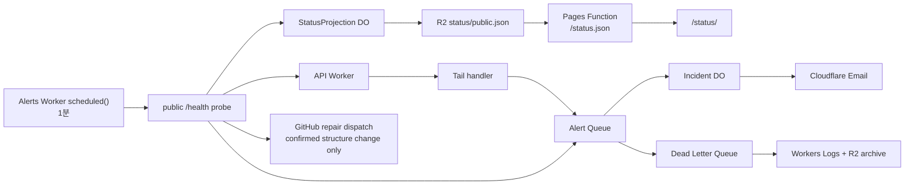

# Ollama Models 플랫폼 최적화 설계

**상태:** 2026-08-01 범위 변경으로 대체됨. 이 문서는 역사적 설계 참고용이며, 현재 범위는 D1 인시던트 감사와 운영자 알림이다. 자동 parser repair와 에이전트 실행은 취소했다.

**날짜:** 2026-07-14
**범위:** 스크래핑 core, Cloudflare Worker API, TypeScript 및 Python client, 모니터링·배포 안정성, 문서, 공개 웹 경험.

## 1. 목적

이 설계는 upstream Ollama 페이지 변경에도 프로젝트가 안정적으로 동작하게 하고, API와 client contract를 일치시키며, 문서 사이트를 완전한 대화형 제품 경험으로 전환합니다. 공개 사이트 방문자는 오래된 독립 playground에 의존하지 않고 모델을 검색하고, tag를 확인하고, API health를 점검하고, API 사용법을 익힐 수 있어야 합니다.

contract 결함에 문서화된 수정이 필요하지 않은 한, 이 설계는 기존 공개 endpoint와 response envelope를 보존합니다. 인증, rate limit, 새 비즈니스 endpoint, 두 번째 backend service는 추가하지 않습니다. 공개 운영 상태 읽기 endpoint인 `/status.json`은 이 불변 조건의 명시적 예외이며 API business endpoint가 아닙니다.

## 2. 제약 조건과 불변 조건

- 운영 Worker는 유일한 HTTP API 구현체로 유지합니다. 테스트는 실제 Hono app을 import하여 실행해야 하며, mock server에서 route나 validation을 재구현해서는 안 됩니다.
- 스크래핑 코드는 Hono, Cloudflare `Context`, Workers cache, OpenAPI routing dependency 없이 실행되어야 합니다.
- `/health`는 cache하지 않습니다. 브라우저는 페이지 로드나 navigation 시 이를 자동 호출해서는 안 됩니다.
- 공개 OpenAPI 문서는 Worker의 `/openapi.json`에서 계속 제공해야 합니다.
- 생성된 reference에 렌더링되는 OpenAPI metadata, live probe, health check, demo 기본값, README quick start, deploy test를 포함한 어떤 공개 예시도 특정 원격 모델의 존재에 의존해서는 안 됩니다.
- 모델 의존 action은 성공한 모델 목록 response에서 대상을 도출하고, 빈 목록을 명시적으로 처리해야 합니다.
- 공식 guide와 machine-readable OpenAPI reference는 별도의 surface입니다. 어느 쪽도 다른 쪽의 endpoint contract를 수동으로 중복해서는 안 됩니다.
- `README.md`, `README.ko.md`, Astro 문서, OpenAPI route metadata, 생성된 reference의 공개 예시는 모두 동적 모델 규칙을 따라야 합니다.
- 모니터링, alerting, failure archive는 Cloudflare 관리형 serverless service로만 구성합니다. 이 설계는 Cloudflare 계정 또는 네트워크 전체 장애를 독립적으로 감시하지 않습니다.
- 공개 Status 페이지는 마지막 완료 probe의 시각과 freshness를 명시하고, snapshot이 없거나 만료되면 `Operational` 대신 `Unknown`을 표시합니다. browser는 `/health`가 아니라 공개 snapshot만 읽습니다.

## 3. 결정 사항

### 3.1 런타임 독립 core package를 추출한다

스크래퍼 도메인 로직을 위한 내부 `packages/core` package를 만듭니다. 이 package는 다음을 소유합니다.

- Worker와 독립적인 표준 domain contract, error code, response validation
- 모델 참조 정규화와 page-range parsing
- 검색 및 모델 tag 페이지용 HTML fetch, parsing, selector 수준 추출
- 검색, tag 조회, health orchestration service
- fixture 기반 parser test

이 package는 명시적인 runtime configuration과 주입된 `fetch` 구현을 받습니다. Hono, Workers cache, route context, `@hono/zod-openapi`에 의존하지 않습니다.

`api/`는 request parsing, HTTP status mapping, OpenAPI metadata, cache policy, `packages/core` 호출만 담당하는 얇은 adapter가 됩니다. 대체 스크래핑 또는 health logic을 포함해서는 안 됩니다.

`packages/ts-client`는 TypeScript response validator를 중복 유지하는 대신 `packages/core`의 client-safe contract entry point를 사용할 수 있습니다. HTML parsing이나 Worker 전용 코드를 import해서는 안 됩니다. Python client는 native Python으로 유지하며, 공개 API contract와 공유 response fixture로 parity를 검증합니다.

**이유:** 현재 API layer 구현은 route 관심사, upstream parsing, health orchestration을 섞고 있습니다. 이를 분리하면 Worker runtime 없이 parser 수정 사항을 test할 수 있고 contract drift를 줄일 수 있습니다.

**비용:** monorepo에 내부 package와 명시적 export boundary가 추가됩니다. build와 test configuration은 path alias에 의존하지 않고 이 boundary를 검증해야 합니다.

### 3.2 tag 조회가 필요한 모든 곳에서 동적 모델 선택을 사용한다

health와 end-to-end 검증은 다음 흐름을 따릅니다.

1. 빈 검색어로 모델 목록을 요청합니다.
2. 반환된 page가 하나 이상이어야 합니다.
3. 반환된 `model_id`를 선택합니다.
4. 그 정확한 identifier로 tag를 조회합니다.
5. 기존 structured error vocabulary로 선택 또는 tag 실패를 보고합니다.

core health service는 빈 검색 요청을 직접 수행해야 하며, 고정 probe keyword를 보유해서는 안 됩니다. 문서와 UI 예시도 같은 의존성을 보여야 합니다. 먼저 검색하고, 그 결과에서 반환된 identifier를 사용해야 합니다. 목록이 비어 있지 않다고 가정하지 말고, 명시적인 빈 결과 branch를 보여야 합니다.

fixture는 parser 구조를 검증하므로 안정적인 synthetic 또는 캡처된 identifier를 포함할 수 있습니다. 이것이 live upstream requirement를 정하는 것은 아닙니다.

**이유:** upstream catalog 내용은 변합니다. 공개 API는 검색과 tag 동작을 보장할 뿐, 특정 catalog entry의 영구적인 존재를 보장하지 않습니다.

**비용:** health에는 의존적인 두 번째 request가 필요하지만, 실제 end-to-end contract를 검증하고 취약한 catalog 가정을 피합니다.

### 3.3 단일 공개 contract chain을 확립한다

공개 API contract의 권한 순서는 다음과 같습니다.

1. core domain schema와 error semantic이 runtime payload 동작을 정의합니다.
2. API는 response shape를 다시 정의하지 않고 이 schema를 Hono/OpenAPI route metadata로 변환합니다.
3. Worker가 생성하는 `/openapi.json`이 공개되는 machine-readable contract입니다.
4. TypeScript와 Python client는 이 contract를 엄격하게 decode하고 동등한 문서화 field를 노출합니다.
5. guide, README 예시, 생성된 reference는 endpoint 표를 수동 유지하지 않고 공개 contract를 사용합니다.

OpenAPI 전용 description, example, parameter annotation은 `api/`에 둘 수 있지만 core shape를 투영해야 하며 별도 정의가 되어서는 안 됩니다. contract test는 실제 Hono response, 생성된 OpenAPI schema, TypeScript decoding, Python decoding 간 불일치를 포착해야 합니다.

OpenAPI metadata는 공개 문서입니다. 검색 예시는 빈 목록 요청을 사용합니다. 모델 참조 예시는 의도적으로 live가 아닌 syntax placeholder를 사용하고, 호출자에게 검색에서 반환된 `model_id`로 대체하라고 알려야 합니다. 생성된 reference는 정확히 그 예시를 표시해야 합니다.

client 개선 사항은 다음과 같습니다.

- HTTP status, API error code, message, request context를 보존하는 structured API error
- 조용한 coercion 대신 잘못된 envelope를 거부하는 strict response parsing
- 각 언어에 적합한 명시적 timeout과 reusable client 동작
- 일치하는 sync/async Python 동작과 typed package distribution
- search response에서 모델 identifier를 얻는 예시

가능한 한 기존 공개 동작을 보존합니다. 실제 compatibility break에는 조용한 client divergence가 아니라 release note와 조정된 version 변경이 필요합니다.

### 3.4 별도 playground 대신 문맥에 맞는 사이트 전역 explorer를 사용한다

문서 경험은 세 개의 분명한 layer로 구성합니다.

| Surface | 주된 목적 | 대화형 동작 |
| --- | --- | --- |
| 홈 (`/`) | 전체 안내형 제품 경험 | 완전한 검색, tag 조회, health 점검, response inspection, 언어별 snippet |
| 공식 guide | 개념, 설치, 사용법, error, migration 도움 | 전체 페이지 form을 중복하지 않으면서 같은 검색, tag, 수동 health action을 노출하는 compact shared API dock |
| OpenAPI Reference (`/reference/`) | 정확한 endpoint schema와 생성된 API reference | Scalar를 통한 operation별 native **Try it** |

기존 `/try/` route는 홈 explorer anchor로 redirect합니다. 두 번째로 독립 유지되는 구현체를 남기지 않습니다. 현재 수동 endpoint reference는 개념적 API guide가 됩니다. 사용법을 설명하고 생성된 reference로 연결할 수 있지만, drift할 endpoint/property table을 수동으로 반복해서는 안 됩니다.

홈 explorer와 guide dock은 하나의 request client, state model, response renderer, accessibility behavior, snippet generator를 공유합니다. 홈은 전체 workspace를 render합니다. dock은 공식 문서 전반에서 사용할 수 있는 compact하고 접근 가능한 launcher이며, 다음 세 capability를 모두 지원합니다.

- 모델 검색
- 선택한 검색 결과 또는 수동으로 입력한 유효한 모델 참조를 사용한 tag 확인
- 명시적 사용자 action 이후에만 health 실행

Dock은 label이 있는 native dialog 또는 동등한 접근성 panel을 사용하고, focus를 관리하며, Escape로 닫을 수 있어야 합니다. request status는 `aria-live`로 보고하고, busy operation에는 `aria-busy`를 지정하며, 중복 submit을 비활성화하고, 모바일에서 사용할 수 있는 layout을 제공해야 합니다. 새 request가 이전 request를 대체하면 stale response를 abort하거나 무시해야 합니다.

response는 사람이 읽을 수 있는 결과를 먼저 보여 주고 raw JSON은 요청 시 표시합니다. 검색 결과는 반환된 identifier를 선택 가능한 값으로 노출합니다. 하나를 선택하면 tag action을 미리 채웁니다. UI는 identifier를 동적으로 도출하는 복사 가능한 request URL, `curl`, TypeScript, Python 예시를 제공합니다. error는 raw JSON만 보여 주지 않고 API code/message와 안전한 recovery action을 보여야 합니다.

session은 마지막 성공 health 결과와 timestamp를 보존할 수 있습니다. 백그라운드에서 health를 조용히 refresh해서는 안 됩니다. 사용자가 명시적으로 refresh를 선택할 수 있어야 합니다.

### 3.5 live canonical specification에서 대화형 OpenAPI reference를 생성한다

`/reference/`에서 pinned package integration으로 Scalar를 사용합니다. checked-in copy가 아니라 docs-origin runtime specification endpoint를 load합니다.

문서 runtime endpoint는 canonical Worker `/openapi.json`을 fetch하고, JSON인지 검증한 뒤 `servers` 값만 `/api`로 바꿔 반환합니다. 이렇게 하면 native Scalar request는 운영과 preview에서 배포된 문서 origin에 남고 Pages API proxy를 통과합니다. SDK consumer를 위한 Worker의 canonical `/openapi.json`은 변경하지 않습니다.

Pages proxy는 공개 API call의 browser boundary로 유지합니다. 다음을 충족해야 합니다.

- upstream base URL에 deployment configuration 사용
- 현재 공개 API가 read-only이므로 `GET`, `HEAD`, 의도적으로 처리한 `OPTIONS`만 허용하고 request body 거부
- 안전한 request header만 전달
- 범위가 제한된 structured upstream failure response 반환
- 명시적인 cache 및 CORS 동작 설정

**이유:** static spec copy는 stale해지고, 직접적인 cross-origin reference는 preview 동작을 일관되지 않게 만듭니다. runtime transformation은 하나의 canonical spec을 유지하고 same-origin `Try it`을 보장합니다.

**비용:** reference는 API에 runtime dependency를 갖습니다. failure를 명확하게 render하고 deployment smoke test로 다뤄야 합니다.

### 3.6 Cloudflare 단독 serverless 모니터링, alert, deployment를 하나의 안정성 경로로 취급한다

이 설계의 monitoring, alerting, 장기 failure 기록은 Cloudflare Workers Paid, Queues, Durable Objects, Workers Logs, Logpush, R2, Email Service만 사용합니다. `workers/alerts` Worker는 generic execution failure를 받는 Tail handler와 별개로, public API `/health`를 확인하는 1분 scheduled monitor를 소유합니다. 같은 Worker가 Queue consumer, Incident Durable Object, StatusProjection Durable Object, R2 binding을 소유하므로 API Worker가 다른 Worker의 Durable Object를 직접 호출하지 않습니다. Cloudflare 전면 장애의 독립 감지는 의도적으로 범위 밖입니다.



#### 권위 있는 health signal과 public freshness를 분리한다

Tail handler는 pathname을 먼저 정규화한 뒤 `/health` event를 `outcome`과 HTTP status에 관계없이 완전히 제외합니다. `/health`에 대한 notification, public Status 전환, parser repair dispatch는 scheduled monitor만 수행합니다. 그 외 `outcome !== "ok"` 또는 `event.event.response.status >= 500`인 API 실행만 Queue에 넣으며, 이는 email·조사용 generic signal일 뿐 public Status 상태 전환이나 parser repair dispatch의 권위 있는 근거가 아닙니다.

`workers/alerts`의 `scheduled()` handler가 유일한 scheduled health publisher입니다. 매 1분 public `/health`를 호출하고 `healthy`, `upstream-degraded`, `parser-structure-change`, `api-unreachable`로 분류합니다. `/health` adapter는 `CheckResult`에 선택적 `skipped: true`를 추가해 search 실패로 실행하지 않은 model probe를 명시하고, 이 check의 `kind`는 `null`로 유지하며 `worstKind()` 집계에서 제외합니다. `ok: false`이면서 skipped가 아닌 origin check는 반드시 non-null `kind`를 가져야 합니다. 현재 scraper contract에서 예외 없이 반환된 빈 `pages` 또는 빈 `tags`는 selector invariant 위반이므로 해당 origin check에서 `structure_change`로 분류합니다. transport·HTTP failure는 origin의 `network_error` 또는 `upstream_down`을 유지하며, aggregate `failure_kind`는 attempted origin check만으로 계산되어 unhealthy result에서 null이 될 수 없습니다. 따라서 model skip이 search의 `upstream_down` 또는 `network_error`를 `structure_change`로 승격할 수 없고, repair candidate는 attempted origin의 confirmed `structure_change`만 됩니다. `healthy`가 아닌 결과는 5초 간격으로 총 3회 확인한 뒤에만 confirmed incident와 repair signal이 됩니다. 각 scheduled cycle은 최종 확인 결과와 `scheduledAt`, `checkedAt`, 단조 증가 `probeVersion`을 StatusProjection DO에 전달합니다. 늦게 끝난 과거 cycle은 더 새 `probeVersion`을 덮어쓸 수 없습니다.

StatusProjection DO는 성공·실패·복구 확인을 포함한 **모든 완료 cycle**마다 `status/public.json`을 R2에 원자적으로 갱신합니다. snapshot은 `checkedAt`과 `freshUntil = checkedAt + 3분`을 포함합니다. R2 `put()`이 완료된 뒤의 binding read는 strong read-after-write consistency를 제공하므로, Pages Function은 R2 custom-domain cache를 거치지 않고 binding에서 읽어 `Cache-Control: no-store`로 반환합니다. Cron 지연, handler failure, R2 write failure로 freshness를 갱신하지 못하면 3분 뒤 public state는 `Unknown`입니다. 정상처럼 보이는 오래된 snapshot을 유지하지 않습니다.

Monitor는 HTTP `200`과 expected `503` 모두에서 body를 읽고 shared `HealthStatusSchema`로 검증한 뒤에만 health classification을 합니다. HTTP status만으로 `api-unreachable`을 만들지 않습니다. transport failure, `200`·`503` 이외의 unexpected status, JSON parse failure, 또는 `503` body를 포함한 schema validation failure만 `api-unreachable`입니다. schema-valid `503`은 `failure_kind`와 attempted checks로 `upstream-degraded` 또는 `parser-structure-change`를 계속 분류하므로 selector repair dispatch를 막지 않습니다.

여기서 shared decoder는 `api/src/schemas.ts`를 직접 import하는 것이 아니라, dependency-free `@ollama-models/core/health-contract` workspace module의 `parseHealthStatus()`와 type guard를 뜻합니다. alerts Worker는 별도 workspace package로 이 module만 import하고 Hono·Zod에 의존하지 않습니다. API의 Zod `HealthStatusSchema`는 OpenAPI boundary에 남기되, valid·invalid fixture를 두 validator에 모두 적용하는 contract test로 decoder와 API schema가 drift하지 않게 합니다.

두 validator는 field shape뿐 아니라 같은 cross-field invariant를 강제합니다. overall `ok`는 attempted check의 모두 성공과 동치여야 합니다. 성공 check는 `kind: null`이어야 하고, skipped check는 `ok: false`, `kind: null`, `count` 없음이어야 합니다. failed·non-skipped origin check는 non-null kind가 있어야 하며, `failure_kind`는 attempted kind의 `worstKind`와 정확히 같고 healthy일 때에만 `null`입니다. 어느 invariant라도 어기면 monitor는 aggregate `failure_kind`를 신뢰하지 않고 `api-unreachable`으로 분류합니다.

Failure confirmation은 단순한 “3회 non-healthy”가 아니라 각 retry의 정규화한 `ProbeIdentity = classification + ordered attempted { componentKey: failureKind } map`이 연속 3회 일치해야 합니다. skipped check는 map에서 제외합니다. class 또는 per-component kind가 한 번이라도 바뀌면 confirmation을 reset하고 `Investigating`으로 유지합니다. repair dispatch는 aggregate `failure_kind`가 아니라 세 identity 모두에서 같은 componentKey가 `structure_change`인 entry만 대상으로 합니다. 예를 들어 `{ search: structure_change, model: upstream_down }`와 `{ search: structure_change, model: network_error }`는 aggregate가 같아도 서로 다른 identity이며, `structure_change`가 아닌 model component를 reparable하다고 추론하지 않습니다.

`ModelPageSchema.parse()` 또는 `ModelTagsSchema.parse()`가 upstream-derived data에서 `ZodError`를 던지면 scraper boundary가 safe schema diagnostic을 가진 `ParseError`로 정규화해야 합니다. 이 예외는 `structure_change`로 분류되며, 프로그래머 오류를 넓게 parser failure로 취급하지 않습니다. 따라서 selector가 남아 있어도 upstream shape가 schema를 위반한 경우 `network_error`로 오분류되어 repair gate를 우회하거나, 반대로 임의의 내부 예외가 repair candidate가 되는 일이 없습니다.

StatusProjection DO는 아래 표를 단일 결정 함수로 구현합니다. Overall과 `components[].state`는 같은 state vocabulary를 사용하며, 표에 없는 입력·projection decode failure는 보수적으로 `Unknown`입니다.

| authoritative observation | Overall | API | Search | Model | incident·repair action |
| --- | --- | --- | --- | --- | --- |
| fresh `healthy`, 열린 incident 없음 | `Operational` | `Operational` | `Operational` | `Operational` | 없음 |
| non-healthy confirmation 1회 또는 2회 | `Investigating` | `Operational` | 실패한 attempted scraper는 `Investigating` | search 의존으로 skipped된 scraper는 `Unknown` | email·repair 없음 |
| confirmed `parser-structure-change`, search만 실패 | `Outage` | `Operational` | `Outage` | `Unknown` | incident 생성, immutable gate를 통과할 때만 parser repair dispatch |
| confirmed `parser-structure-change`, model만 실패 | `Degraded` | `Operational` | `Operational` | `Outage` | incident 생성, immutable gate를 통과할 때만 parser repair dispatch |
| confirmed `upstream-degraded`, scraper 하나만 실패 | `Degraded` | `Operational` | 성공 scraper는 `Operational`, 실패 scraper는 `Degraded` | 성공 scraper는 `Operational`, 실패 scraper는 `Degraded` | incident 생성, repair 없음 |
| confirmed `upstream-degraded`, scraper 둘 다 실패 | `Outage` | `Operational` | `Outage` | `Outage` | incident 생성, repair 없음 |
| monitor가 `/health`를 transport failure, unexpected HTTP status(`200`·`503` 이외), JSON parse failure 또는 schema-invalid body 때문에 3회 읽지 못함 | `Outage` | `Outage` | `Unknown` | `Unknown` | incident 생성, repair 없음 |
| 열린 incident 중 healthy confirmation 1회 또는 2회 | `Recovering` | 관측된 affected component는 `Recovering` | 관측된 affected component는 `Recovering` | 관측된 affected component는 `Recovering` | incident를 닫거나 recovery email을 보내지 않음 |
| 열린 incident 중 healthy confirmation 3회 | `Operational` | `Operational` | `Operational` | `Operational` | incident resolve, recovery email 1회 |
| snapshot missing·stale 또는 Pages reader fetch·parse failure | `Unknown` | `Unknown` | `Unknown` | `Unknown` | browser는 probe·repair를 시작하지 않음 |

열린 health incident에서 첫 healthy 결과는 `Recovering`을 시작할 뿐 `Operational`이나 recovery email을 만들지 않습니다. 서로 다른 scheduled cycle의 healthy 결과가 연속 3회 확인될 때만 Incident DO는 incident를 해제하고 StatusProjection DO는 `Operational`을 게시합니다. 따라서 status page, incident lifecycle, recovery email이 같은 threshold를 공유합니다.

기존 GitHub health workflow는 scheduled probe나 alert publisher로 유지하지 않습니다. Cloudflare scheduled monitor가 지속된 `parser-structure-change`를 확인한 뒤에만 최소 권한의 authenticated dispatch로 repair workflow를 시작합니다. repair workflow는 다시 health를 probe하거나 email을 보내지 않습니다.

Tail handler는 `async tail(events, env, ctx)` 형태를 사용합니다. Queue enqueue처럼 Tail handler 수명 이후에도 완료되어야 하는 작업은 반드시 `ctx.waitUntil()`에 등록하고, Tail handler에서 Email Service를 직접 호출하지 않습니다.

#### 정규화, incident lifecycle, 재시도

Tail Worker와 scheduled monitor는 compact `AlertEvent`를 Queue에 보냅니다. event에는 source, script name, 정규화한 path, HTTP status family 또는 failure kind, public error code, 발생 시각만 포함합니다. query string, raw exception, request header, secret은 event, incident key, public snapshot, email body에 넣지 않으며, Tail request의 `getUnredacted()`는 호출하지 않습니다.

`componentKey = scriptName|source|normalizedPath`는 recovery lookup에 사용하고, `incidentFingerprint = componentKey|statusFamily-or-failureKind|errorCode`는 failure dedup metadata에 사용합니다. healthy event는 component key로 열린 incident를 찾아야 하므로 failure-only fingerprint를 재구성하려고 해서는 안 됩니다.

Incident DO는 confirmed failure당 한 번의 **장애 시작 알림**만 보내고, 반복 event는 억제 수와 조사 log만 갱신합니다. 열려 있는 incident에 대한 10분 주기 reminder는 보내지 않습니다. 3회 consecutive healthy 뒤에는 지속 시간과 억제 수를 포함한 한 번의 **정상 복구 알림**만 보냅니다.

Queue consumer는 Incident DO의 notification 결과를 반드시 `await`합니다. DO는 `env.EMAIL.send()`가 resolve한 뒤에만 성공 상태를 기록하며, delivery failure를 삼키지 않고 consumer에 propagate합니다. consumer는 그 failure를 다시 throw하여 Queue retry를 시작합니다. 5회 delivery failure는 DLQ로 보내고, DLQ consumer는 secret 없이 incident key와 delivery failure를 Workers Logs와 R2에 남깁니다. Queue는 at-least-once delivery이므로 Email Service 성공 직후 process가 종료되면 드물게 중복 email이 생길 수 있습니다. 이를 정확히 한 번 delivery라고 주장하지 않습니다.

#### 자동 복구와 에이전트 실행 — 취소됨

이전 설계의 제한된 parser repair automation, repair dispatch, agent sandbox, 자동 PR, verification gate, merge/deploy 전제는 현재 범위에서 구현하지 않는다.

- `health-monitor.yml`은 `/health` probe와 관찰 로그만 수행한다.
- `auto-heal.yml`은 제거되었고 workflow dispatch 경로가 없다.
- selector 수정은 운영자가 branch, test, PR 절차로 처리한다.
- 자동 복구를 다시 검토하려면 별도 ADR에서 권한, 검증, rollback을 먼저 승인한다.

문서 build는 `docs/dist`를 출력합니다. Pages deployment는 `docs/`를 working directory로 삼고 Pages project root의 source directory `docs/functions`를 자동 발견하며, `pages_build_output_dir = "./dist"`가 있는 `docs/wrangler.toml`을 source of truth로 사용합니다. publish 대상은 `docs/dist`뿐이며 build가 `dist/functions`에 복사했다는 이유만으로 해당 경로가 실행 가능해진다고 기대해서는 안 됩니다. current Wrangler에는 `--functions` deploy option이 없으므로 deploy workflow는 `docs/`에서 `wrangler pages deploy --project-name ollama-models --branch main`을 실행합니다. `/api/*` proxy, `/status.json`, runtime reference transform은 deployment-dependent Function입니다.

문서 build는 `docs/project.json`에서 `cp -r functions dist/functions`를 제거해야 합니다. `docs/functions`는 static asset output 바깥에 있어야 하며 `/functions/` 아래에 publish해서는 안 됩니다. Pages는 이를 Functions source directory로만 받아야 합니다.

### 3.7 Status 페이지는 probe를 실행하지 않는 public operational surface다

Status 페이지는 기존 Pages deployment의 `/status/`에 둡니다. browser는 초기 load, document visibility 복귀, visible 상태의 60초 polling에서만 same-origin `GET /status.json`을 호출합니다. `/health`를 호출하거나 status data가 없을 때 health probe를 시작해서는 안 됩니다.

`/status.json`은 Pages Function의 읽기 전용 operational endpoint이며, 아래 두 public-safe response 중 정확히 하나를 반환합니다. browser의 shared parser는 먼저 root가 non-null object인지 검증한 뒤, `kind === "unavailable"`일 때만 strict `UnavailableStatusResponse` decoder를 선택합니다. `kind`가 없을 때는 strict `PublicStatusSnapshot` decoder를 선택하고, 다른 `kind` 값 또는 snapshot의 어떤 `kind` field도 거부합니다. 따라서 이는 Zod `discriminatedUnion("kind", ...)`이 아니라 structural union parser이며, snapshot은 unavailable branch를 필요로 하지도 수용하지도 않습니다.

```ts
type PublicStatusResponse = PublicStatusSnapshot | UnavailableStatusResponse;

type PublicStatusSnapshot = {
  kind?: never;
  schemaVersion: 1;
  probeVersion: number;
  checkedAt: string;
  freshUntil: string;
  state: "operational" | "investigating" | "degraded" | "outage" | "recovering" | "unknown";
  components: Array<{
    id: string;
    label: string;
    state: "operational" | "investigating" | "degraded" | "outage" | "recovering" | "unknown";
    checkedAt: string;
  }>;
  activeIncidents: Array<{
    id: string;
    state: "operational" | "investigating" | "degraded" | "outage" | "recovering" | "unknown";
    startedAt: string;
    updatedAt: string;
    affectedComponents: string[];
    summary: string;
  }>;
  resolvedIncidents: Array<{
    id: string;
    startedAt: string;
    resolvedAt: string;
    affectedComponents: string[];
    summary: string;
  }>;
};

type UnavailableStatusResponse = {
  schemaVersion: 1;
  kind: "unavailable";
  state: "unknown";
};
```

fresh `PublicStatusSnapshot`만 `200`과 `Cache-Control: no-store`로 반환합니다. snapshot missing·stale, R2 read failure, 또는 projection parse failure는 raw cause 없이 `503`, `Cache-Control: no-store`, strict exact `UnavailableStatusResponse`를 반환하고 UI는 `Unknown`을 표시합니다. `Operational`은 fresh snapshot, 열린 incident 없음, recovery threshold 충족을 모두 만족할 때만 표시합니다. raw error, upstream URL 또는 query, request header, secret, email recipient, retry metadata는 어느 response variant에도 포함하지 않습니다.

초기 UI는 큰 사람이 읽을 수 있는 현재 상태와 마지막 확인 시각, component rows, 활성 incident, 실제 해결된 recent incident만 보여 줍니다. 수집 전의 uptime percentage, 30/90일 availability chart, 채워 넣은 과거 데이터는 만들지 않습니다. component state는 색뿐 아니라 text와 icon으로 표현하고, 갱신 결과는 `aria-live="polite"`로 알리며, time element와 keyboard 접근을 제공하고 reduced-motion을 존중합니다. Cloudflare UI를 복제하지 않고 기존 문서의 밝고 정보 중심인 visual language를 사용합니다. 페이지 footer는 browser가 upstream health check를 실행하지 않고 마지막 scheduled monitoring snapshot을 읽는다고 명시합니다.

Deployment는 다음 순서로 각 공개 boundary를 검증합니다.

1. build, unit, integration, contract check
2. API deploy 및 동적 모델 선택을 사용한 direct API smoke check 실행
3. `docs/dist` build, 해당 directory deploy, Pages Functions source로 `docs/functions` 연결
4. 실제 browser로 배포된 Pages proxy, 홈 explorer, guide dock, `/reference/` 실행
5. runtime reference가 `/api`를 server로 사용하고 native `Try it`이 공개 proxy에 도달하는지 검증

기존 direct API end-to-end check는 계속 유효하지만, deploy 후 Pages/browser validation을 대체하지는 않습니다.

## 4. Component boundary

```text
packages/core
  contracts/       Response/error schema와 공유 domain type
  parsing/         모델 참조, range, search HTML, tag HTML parsing
  transport/       구성된 upstream fetch와 response classification
  services/        Search, tag, 동적 health orchestration

api
  routes/          Hono request/response와 OpenAPI route definition
  cache/           Endpoint TTL policy
  schemas/         Core contract를 투영한 OpenAPI metadata

packages/ts-client
  client/          Typed request boundary, strict decoding, structured error

packages/py-client
  client/          동등한 sync/async request boundary와 strict model

docs
  explorer/        공유 request client, state, renderer, snippet, style
  home/            전체 explorer 구성
  integrations/    Starlight header/page integration과 compact dock
  reference/       Scalar page와 runtime spec transform
  functions/api/   강화된 same-origin API proxy
  functions/status.json  public-safe R2 snapshot reader
  status/                public operational status page

workers/alerts
  tail/                  generic execution failure normalization
  monitor/               authoritative 1-minute public /health classifier
  incident/              email lifecycle and dedup Durable Object
  status-projection/     public snapshot Durable Object and R2 writer
```

의존 방향은 단방향입니다. `api`와 client는 core contract에 의존하고, core는 이들에 의존하지 않습니다. 문서는 공개 HTTP API만 호출합니다. 생성된 reference는 docs runtime transform을 통해 canonical published specification을 읽습니다.

## 5. Error handling과 보안 동작

| Boundary | 필수 동작 |
| --- | --- |
| Upstream HTML fetch | network/status/content failure를 분류하고, 안전한 diagnostic context를 포함하며, 인식되지 않은 document에서 parser 성공을 주장하지 않음 |
| Parser | 필수 structure가 없으면 fail closed하고 repair workflow에 충분한 selector diagnostic 유지 |
| Core service | 공개 error-code mapping을 보존하는 typed domain failure 반환 또는 throw |
| API adapter | domain failure를 기존 structured error envelope와 문서화된 HTTP status로 변환 |
| Client | API error 정보를 보존하고 transport, timeout, decoding, API failure를 구분 |
| Docs proxy | 지원하지 않는 method를 거부하고, 전달 header를 제한하며, upstream transport failure를 범위가 제한된 안전한 response로 변환 |
| UI | stack trace를 노출하지 않고 recovery guidance와 선택적인 raw API payload만 제공 |
| Alert | Tail execution failure와 Cron health failure를 별도로 정규화하고, Queue retry·DLQ·Durable Object cooldown으로 처리하며, delivery failure는 secret 없이 Logs와 R2에 남김 |
| Public status | 마지막 완료 probe의 public-safe projection만 반환하고, missing·stale·fetch failure에서는 `Unknown`을 표시하며 browser health probe를 시작하지 않음 |

어떤 browser surface도 secret을 저장하거나 static remote-model identifier에 의존하거나, 정상 escaping 없이 신뢰할 수 없는 모델 데이터를 HTML에 interpolate해서는 안 됩니다.

### 운영 위험과 통제

| 위험 | 결과 | 통제 |
| --- | --- | --- |
| Core extraction이 기존 response를 우발적으로 변경 | migration 중 client 또는 API 동작 regression | 한 번에 service 하나씩 이동하고, 기존 구현을 삭제하기 전에 semantic response/error fixture와 실제 app integration 결과 비교 |
| Upstream markup이 예기치 않게 변경 | search 또는 tag data가 잘못되거나 조용히 불완전해짐 | 필수 structure에서 fail closed하고, parser diagnostic을 유지하며, monitoring에서 failure를 분류하고, 검토한 selector repair로 fixture 갱신 |
| 생성된 reference가 API에 도달하지 못함 | reference를 render할 수 없거나 `Try it`을 실행할 수 없음 | 명확한 failure state를 render하고, reference package를 pin하며, deployment 뒤 runtime spec transformation과 same-origin request 검증 |
| Pages proxy가 안전하지 않은 request data를 전달 | browser-facing proxy가 피할 수 있는 attack surface 생성 | method 제한, body 거부, deployment configuration의 upstream URL 사용, 명시적 safe header set만 전달 |
| Navigation이 반복 health check를 유발 | 방문자가 불필요한 upstream load를 만들고 변동성 큰 status를 봄 | explorer와 guide는 명시적 사용자 action에서만 health를 실행하고, Status 페이지는 `/health` 대신 no-store `/status.json`만 읽음 |
| Status snapshot이 오래되거나 순서가 뒤집힘 | 실제 상태와 다른 녹색 상태를 공개 | 1분 authoritative probe, `probeVersion` ordering, 3분 `freshUntil`, stale 시 `Unknown`, R2 binding read와 no-store response |
| 자동 repair가 contract 또는 권한을 넓힘 | agent patch가 API compatibility 또는 운영 권한을 훼손 | static allowlist, model과 credential 분리, GitHub App coordinator, immutable verification gate, `needs-review` fallback |
| merge 뒤 production failure | health regression이 production에 남음 | isolated candidate verification을 prerequisite로 만들고, trusted post-deploy E2E failure handler가 last-known-good version 또는 commit으로 rollback |

별도로 문서화한 contract correction이 필요하지 않은 한 rollout은 endpoint path, status mapping, cache TTL을 보존합니다. Worker와 Pages layer의 deployment는 독립적으로 rollback할 수 있으며, 어떤 migration도 data conversion이나 영구적인 upstream state 변경을 요구하지 않습니다.

## 6. 문서와 예시 정책

- `README.md`, `README.ko.md`, TypeScript package README, Python package README, Astro guide는 같은 모델 선택 흐름을 적용합니다.
- 예시는 search response에서 사용할 수 있는 identifier를 얻고 빈 목록 branch를 명확히 보여야 합니다.
- 공개 base URL과 endpoint parameter 규칙은 route validation과 일치해야 합니다. 특히 API가 namespace-qualified reference를 요구하는데 예시가 bare model reference를 약속해서는 안 됩니다.
- 영문과 국문 문서는 같은 field name, error semantic, 지원 Python version, API 동작을 설명해야 합니다.
- 공식 guide는 설명, 설치, pattern, migration advice를 소유합니다. 생성된 reference는 정확한 schema, parameter, response detail을 소유합니다.
- OpenAPI generation check는 CI gate로 유지합니다. 어떤 docs build도 생성된 JSON artifact를 독립 유지되는 source로 site에 복사해서는 안 됩니다.
- OpenAPI route metadata와 생성된 `/openapi.json`은 공개 예시 정리에 포함됩니다. 고정 catalog identifier 대신 빈 목록 흐름 또는 label이 있는 non-live syntax placeholder를 사용합니다.

## 7. 검증 전략

### Core와 API

- Parser unit test는 정상, 빈 결과, malformed, pagination, selector-change case에 대해 캡처 또는 synthetic HTML fixture를 사용합니다.
- Service test는 health가 빈 search에서 시작하여 그 search가 반환한 identifier를 tag에 사용함을 증명합니다.
- API integration test는 upstream fetch와 Workers 전용 global만 boundary에서 stub하여 실제 Hono app을 실행합니다.
- Route test는 cache policy, structured error, normalization, OpenAPI freshness를 검증합니다.

### Client와 공개 contract

- TypeScript test는 success, API error, transport error, timeout, 잘못된 response envelope를 다룹니다. 특히 health payload에서 필수 `checks.*.kind` 또는 `failure_kind`가 누락된 경우와 overall·check·aggregate cross-field invariant를 위반한 경우를 모두 거부해야 합니다.
- Python test는 동등한 sync 및 async path, malformed response 거부, health의 필수 kind 및 cross-field invariant 거부, package typing, connection reuse policy를 다룹니다. decoder는 dataclass를 만들기 전에 exact JSON type을 검증하며 `bool(...)`, `str(...)`, `int(...)` coercion으로 malformed field를 수용해서는 안 됩니다.
- Contract test는 대표 API response를 생성된 OpenAPI schema 및 두 client decoder와 비교합니다.
- README, guide, 생성된 OpenAPI, Scalar reference check는 공개 고정 모델 예시와 stale field 또는 parameter name을 거부합니다.

### 안정성과 deployment

- Cron monitor test는 1분 cadence, outcome 분류, 3회 failure 확인, 3회 consecutive recovery, `GET /health` status alert의 단일 publisher 보장, persistent `parser-structure-change`만 repair dispatch하는지 검증합니다.
- Status projection test는 모든 completed cycle의 publish, `probeVersion` ordering, 3분 freshness expiry, stale/missing/fetch failure의 `Unknown`, public field redaction을 다룹니다.
- Pages status-function contract test는 fresh snapshot의 exact `200 PublicStatusSnapshot`와 `no-store`, 그리고 missing·stale·R2 read·projection parse failure 각각의 exact `503 UnavailableStatusResponse`, `no-store`, raw cause 부재를 검증한다. shared structural parser는 non-object와 unknown `kind`를 거부하고, `kind` 없는 snapshot을 수용하며 `kind: "unavailable"` branch를 snapshot으로 수용하지 않음을 검증한다.
- Tail 및 Queue test는 `outcome = ok`와 HTTP `5xx`의 차이, `ctx.waitUntil()` enqueue, sanitized event schema, component-key recovery lookup, start/recovery-only email, awaited delivery failure propagation, retry, DLQ를 다룹니다.
- Repair coordinator test는 deterministic diff allowlist, credential-free patch artifact, GitHub App verification trigger, `needs-review` downgrade를 다룹니다. candidate deployment와 rollback은 trusted workflow integration test로 검증합니다.
- Deployment smoke check는 `docs/dist`가 `docs/functions`를 연결한 상태로 deploy되고, `docs/dist/functions`가 static asset에 없으며, direct API 동작이 정상이고, Pages `/api`와 `/status.json`이 각각 제한된 proxy와 public snapshot을 올바르게 제공하는지 검증합니다.

### Browser 경험

- Browser test는 홈에서 search → 반환된 선택 identifier → tag lookup 흐름과 search가 빈 목록을 반환할 때 tag를 호출하지 않고 명시적 empty state를 표시하는 branch를 다룹니다. 특정 live catalog model이나 nonempty 결과를 fixture처럼 가정하지 않습니다. 또한 명시적 health action, 접근 가능한 error 및 busy state, 복사 가능한 snippet, 모바일 layout을 다룹니다.
- Guide page test는 공유 dock에 도달할 수 있고 모든 action이 같은 공개 proxy path를 사용함을 확인합니다.
- Reference test는 `/reference/`가 변환된 live specification을 load하고 `/api`를 server로 선언하며 Scalar `Try it`이 공개 docs origin을 통해 request를 전송함을 확인합니다.
- Visual review는 desktop과 좁은 mobile layout, keyboard navigation, focus restoration, high-contrast text, 의도하지 않은 자동 health request가 없음을 다룹니다.
- Status browser test는 `/health` request가 전혀 발생하지 않고, `/status.json`의 fresh snapshot state·`Recovering`·exact `503 UnavailableStatusResponse`의 `Unknown`을 올바르게 render하며, structural parser가 unavailable variant를 snapshot으로 decode하지 않음을 확인한다. visibility refresh, `aria-live`, keyboard navigation, mobile layout을 다룬다.

## 8. 제공 순서

1. **Core extraction과 contract foundation** — 내부 package를 추가하고 parsing/service를 이동하며 error semantic을 보존하고 fixture/service test를 확립합니다.
2. **API adaptation** — Worker route를 adapter로 축소하고 cache behavior를 보존하며 contract를 OpenAPI에 투영하고 실제 app integration을 검증합니다.
3. **Client parity와 문서 contract 정리** — TypeScript/Python decoding과 error를 강화하고, 두 root README와 OpenAPI route metadata를 포함한 모든 공개 예시를 동적 선택으로 갱신합니다.
4. **안정성·Status 경로** — Cloudflare 1분 health monitoring, Tail·Queue·Durable Object alert observability, public R2 status projection과 Pages reader, selector-repair dispatch safeguard, Workers Logs·Logpush·R2 failure archive, auto-repair trust gate의 foundation, docs deploy output, 동적 deployment check를 수정합니다.
5. **정보 구조와 interaction layer** — 홈 explorer, 사이트 전역 guide dock, 강화된 Pages proxy, 기존 playground redirect, guide/reference 분리를 구현합니다.
6. **생성된 reference와 최종 validation** — runtime spec transformation과 pinned Scalar integration을 추가하고 contract, browser, accessibility, mobile, 배포된 end-to-end check를 실행합니다.

각 제공 순서는 독립적으로 test할 수 있지만, 공개 문서 경험은 Pages proxy, 홈 explorer, guide dock, 생성된 reference를 모두 함께 검증한 뒤에야 완전합니다.

## 9. 검토한 대안

| 대안 | 결정 | 이유 |
| --- | --- | --- |
| Scraping과 health logic을 API route에 유지 | 기각 | Parser 동작이 Worker와 HTTP 관심사에 결합되어 test와 reuse가 어려워짐 |
| 새 network microservice로 분리 | 기각 | 현재 scale 문제를 해결하지 못하면서 deployment와 운영 비용만 추가 |
| 미리 선택한 catalog item probe | 기각 | Health와 예시를 변동성 있는 upstream inventory에 결합 |
| 독립 `/try/` page 유지 | 기각 | interaction 구현을 중복하고 나머지 site를 수동적으로 만듦 |
| 모든 guide page에 전체 API form render | 기각 | 큰 UI를 반복하고 문서 content와 경쟁 |
| 수동 endpoint 문서만 사용 | 기각 | 정확한 schema table이 executable contract에서 drift |
| static OpenAPI JSON을 docs site에 commit | 기각 | Reference가 stale해지고 preview request가 잘못된 origin을 대상으로 할 수 있음 |
| 설명 guide 없이 생성된 reference만 사용 | 기각 | 생성된 schema는 onboarding, example, error guidance, narrative documentation을 대체하지 못함 |
| Cloudflare 외부 serverless sentinel | 기각 | monitoring과 alerting은 Cloudflare 단독 serverless로 구성하며, Cloudflare 전면 장애의 독립 감지는 이 설계 범위 밖 |
| Self-hosted monitoring 또는 logging | 기각 | 운영 서버, patching, backup 부담을 도입하지 않는 serverless-only 제약과 맞지 않음 |
| Browser가 Status 페이지에서 `/health`를 직접 호출 | 기각 | 방문자 수가 upstream probe 빈도를 바꾸고 stale·failure semantics가 browser마다 달라짐 |
| 열린 incident가 없다는 이유로 `Operational` 추론 | 기각 | monitor 또는 projection failure 중에 거짓 녹색 상태를 만들 수 있음 |
| LLM review만으로 parser-only auto-merge 결정 | 기각 | model 판단은 permission boundary가 아니며 static diff allowlist와 independent gate가 필요 |
| 현재 shared staging check를 auto-merge gate로 사용 | 기각 | `main` push 이후에만 실행되어 production 이전 검증이 아님 |

## 10. 수용 기준

다음 조건이 모두 참이면 작업이 완료됩니다.

1. Scraper, health, 모델 참조 logic은 Worker/Hono dependency 없이 내부 core package에서 실행됩니다.
2. API response, 생성된 OpenAPI, TypeScript client, Python client는 문서화된 success 및 error envelope에 동의합니다.
3. Health, end-to-end probe, demo, 공개 quick start, 생성된 `/openapi.json`, Scalar example은 빈 search 결과에서 동적으로 모델을 선택하거나 label이 있는 non-live syntax placeholder를 사용합니다. 어느 것도 고정 원격 모델에 의존하지 않습니다.
4. Root 영문 및 국문 README가 공개 예시 정리에 포함됩니다.
5. 배포된 홈은 사용자에게 완전한 search, tag, 명시적 health 경험을 제공하며, guide page는 접근 가능한 compact dock을 통해 같은 기능을 노출합니다.
6. `/try/`는 더 이상 별도의 demo를 구현하지 않습니다.
7. `/reference/`는 Worker의 canonical specification을 runtime에 source로 삼는 생성된 대화형 reference를 제공하고, `/api`를 통해 `Try it`을 전송합니다.
8. Pages deployment는 `dist/functions` 없이 `docs/dist`를 제공하고 source `docs/functions`를 Functions로 연결하며, 문서 deployment 뒤 method-constrained, failure-safe proxy를 실행합니다.
9. Monitoring과 alerting은 Cloudflare 관리형 serverless service만 사용합니다. Alerts Worker의 1분 scheduled monitor는 `/health` failure와 parser repair의 유일한 권위 있는 publisher이고, Tail은 generic execution signal을 별도로 처리합니다. Queue·Incident DO·DLQ·Logs·Logpush/R2는 안전한 delivery와 조사 경로를 제공합니다. Cloudflare 전면 장애의 독립 alert는 제공하지 않습니다.
10. `/status/`는 browser health probe를 실행하지 않고 no-store `/status.json`의 마지막 completed snapshot만 표시합니다. snapshot은 3분 뒤 `Unknown`이 되며, 공개 UI는 실제 active/resolved incident만 표현하고 임의의 historical uptime을 만들지 않습니다.
11. 자동 repair는 confirmed parser-structure-change의 deterministic parser-only allowlist에서만 PR을 준비합니다. model은 write/merge credential을 받지 않으며, contract·workflow·deployment·dependency change는 `needs-review`입니다. unattended merge는 isolated candidate verification과 rollback gate가 준비되기 전에는 수행하지 않습니다.
12. 변경된 path의 증거를 바탕으로 targeted unit, integration, client, contract, browser, accessibility, 배포 smoke check가 통과합니다.
